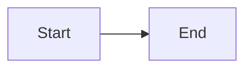

<p align="center">
  
</p>

# Engineering Blog

Source repository for engineering blog posts published on [openteams.com/engineering-blog](https://openteams.com/engineering-blog/).

## How It Works

1. Write your post as a `.md` file in `posts/`.
2. Open a pull request for review, and answer the social brief CI adds to it.
3. Once merged to `main`, the post goes live.

Changing the site's code or settings? See [DEVELOPMENT.md](DEVELOPMENT.md).

## Guest Posts

Only people with write access can open pull requests here. If you're a guest author, or an OpenTeams member with read-only access:

1. Open a [Request write access](https://github.com/openteams-ai/engineering-blog/issues/new?template=request-write-access.yml) issue. OpenTeams members get write access within a minute, and the issue closes itself.
2. Guests only: if the admin approves, accept the email invite from GitHub.
3. Follow the [Writing Guide](#writing-guide).

## Repository Structure

```text
posts/
├── building-ml-pipelines.md        # Article files
├── scaling-with-duckdb.md
└── images/
    ├── building-ml-pipelines/      # Images per article
    │   └── architecture.png
    └── scaling-with-duckdb/
        └── benchmark.png
authors.json                        # Author names, bios and photos
social/                             # One social brief per post
```

## Writing Guide

### Creating a Post

1. Create `posts/your-article.md`: [frontmatter](#frontmatter) at the top, then your content in markdown.
2. First post? Add yourself to `authors.json` (see [Author Profile](#author-profile)).
3. Write a title, slug and meta description.\
   With Claude Code: `/seo-meta-description posts/your-article.md`
4. Draw a thumbnail in `src/components/art/<slug>.astro`, using an existing one as a model.\
   With Claude Code: `/draw-card-art posts/your-article.md`
5. Answer the [social brief](#social-brief) in `social/<slug>.yml`.\
   With Claude Code: `/fill-social-brief posts/your-article.md`
6. Open a PR from a branch in this repo rather than a fork.

The PR's checks fail until your post has a thumbnail, a social brief, and authors listed in `authors.json`.

### Preview

- **On your PR:** CI comments a preview link to the whole site with your post in it, and updates it on every push.
- **Locally:** run `npm install` once, then `npm run dev` and open <http://localhost:4321/engineering-blog>. The page reloads on every save.

### Frontmatter

```yaml
---
title: "Your Post Title"
slug: your-post-slug
date: 2026-10-01
topic: ai-engineering
authors:
  - your-author-slug
meta_description: "A short summary for search and link previews (150-160 chars)."
---
```

| Field | Required | Notes |
| --- | --- | --- |
| `title` | ✅ | |
| `slug` | ✅ | The post's address. Don't change it once the post is live. |
| `date` | ✅ | |
| `topic` | ✅ | One of `llms-inference`, `ai-engineering`, `python-tooling`, `practices` |
| `authors` | ✅ | Slugs from [`authors.json`](#author-profile). The first is the main author. |
| `meta_description` | Recommended | 150–160 characters for search and link previews |

With Claude Code, `/seo-meta-description posts/your-article.md` suggests the title, slug and meta description.

### Author Profile

If this is your first post, add yourself to `authors.json`:

```json
{
  "slug": "your-author-slug",
  "name": "Your Name",
  "bio": "Your role at OpenTeams and what you write about.",
  "avatarUrl": "https://avatars.githubusercontent.com/u/<your-id>",
  "links": { "github": "https://github.com/<you>", "linkedin": "https://www.linkedin.com/in/<you>/" }
}
```

The easiest `avatarUrl` is your GitHub avatar's address. To use a photo file instead, put it in `public/authors/<slug>.jpg` (about 264px wide) and set `avatarUrl` to `/authors/<slug>.jpg`.

`links` is optional: `github`, `linkedin`, `x`, `bluesky` or `website`, each a full address. They show as icons on your author page and under your posts.

### Social Brief

Every new post needs a short social brief, which is used to write its LinkedIn post. It lives in `social/<slug>.yml`. If you open your PR without one, it is added to the PR for you to answer.

The comment above each field is its question, and the allowed values are listed for `audience`. The three written answers need at least 8 words each, so they carry the article's specifics. Good answers:

- **`problem`:** What problem does this article solve? (1-2 sentences)
- **`what_it_does`:** What does the article build, test, compare, or argue? (1-2 sentences)
- **`remember_one_thing`:** If readers remember one thing, what should it be? (1 sentence)
- **`audience`:** Who should read this? Pick one or more, usually the 1-3 groups the article is written for:
  - `data-scientists`
  - `ml-ai-engineers`
  - `python-developers`
  - `platform-devops-engineers`
  - `security-compliance-engineers`
  - `oss-maintainers`
  - `engineering-leaders`

You can either answer the questions yourself or with your AI assistant. To have your AI assistant answer them, run `/fill-social-brief posts/your-article.md`.

#### Examples

Here are some examples of social briefs from real posts in this repo:

**An experiment** (`posts/llm-review-reliability.md`):

```yaml
problem: "Using a second model to review a first model's output might not be a reliable safety layer, as the second model can also be wrong."
what_it_does: "Tests six local reviewer models on 35 hand-labeled claims from MeetingBank summaries, scoring how many unsupported claims each catches and how many true claims it wrongly deletes."
remember_one_thing: "Ensure you test a reviewer model on a few samples yourself before relying on it as a safety layer in production."
audience: ["ml-ai-engineers", "data-scientists"]
```

**An essay** (`posts/slow-down-youre-already-shipping-faster.md`):

```yaml
problem: "AI coding tools speed developers up so much that you might miss subtle bugs and security gaps."
what_it_does: "Argues for a handful of habits: start from a reviewed plan, keep PRs small, make small edits by hand, keep instruction files lean, and have a different agent review the PR."
remember_one_thing: "It is worth it to spend some time to ensure the AI did a good job instead of spending more time fixing the mistakes it makes later."
audience: ["ml-ai-engineers", "engineering-leaders"]
```

**A benchmark** (`posts/benchmark-python-package-managers.md`):

```yaml
problem: "ML projects need packages from both conda-forge and PyPI, and conda is slow to solve while pip and poetry can't use conda-forge at all."
what_it_does: "Benchmarks six package managers on one ML project with 25 direct dependencies split across conda-forge and PyPI, timing installs and lockfile generation."
remember_one_thing: "Which tool is fastest depends on your project needs."
audience: ["ml-ai-engineers", "python-developers"]
```

### Images

Place images in `posts/images/<post-slug>/` and reference them with relative paths.

```markdown

```

### Card Art

Your post's thumbnail is a small drawing that shows its main idea.

- **Draw it:** with Claude Code, run `/draw-card-art posts/your-article.md`, or manually edit `src/components/art/<slug>.astro`.
- **See it:** run `npm run dev` and open <http://localhost:4321/engineering-blog/card-preview/your-post-slug/>. The page reloads when you save.

### Markdown Syntax Reference

#### Code Blocks

Code blocks are syntax-highlighted. Name the language after the opening fence:

````markdown
```python
def hello():
    print("Hello, world!")
```
````

#### Mermaid Diagrams

Rendered automatically. Readers can click a diagram to open it full screen.

````markdown

````

#### Other Supported Elements

| Element | Syntax |
| --- | --- |
| Bold | `**text**` |
| Italic | `*text*` |
| Inline code | `` `code` `` |
| Link | `[text](url)` |
| Image | `` |
| Blockquote | `> text` |
| Table | Standard markdown table syntax |
| Horizontal rule | `---` |
| Ordered list | `1. item` |
| Unordered list | `- item` |
| Nested list | Indent with 2 or 4 spaces |
