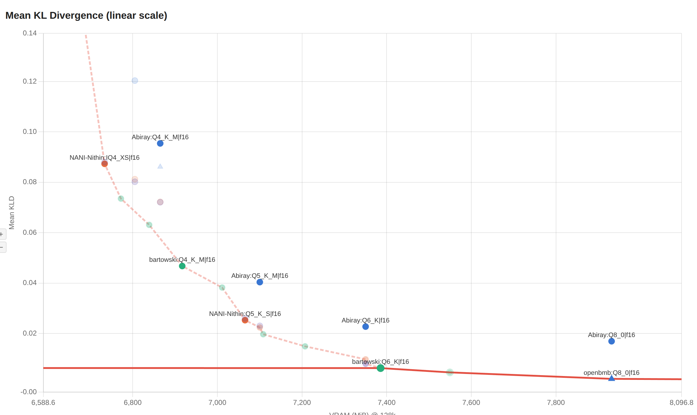
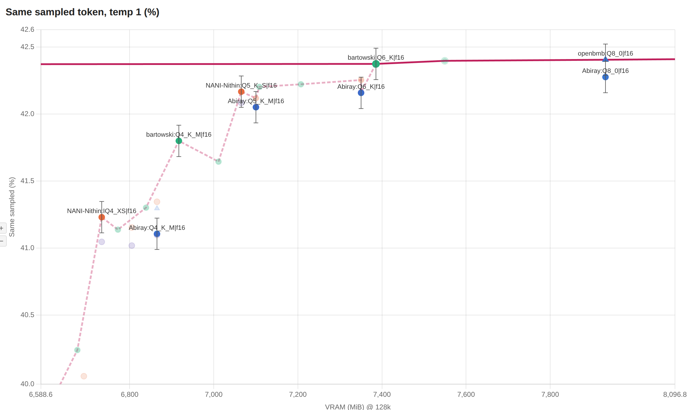
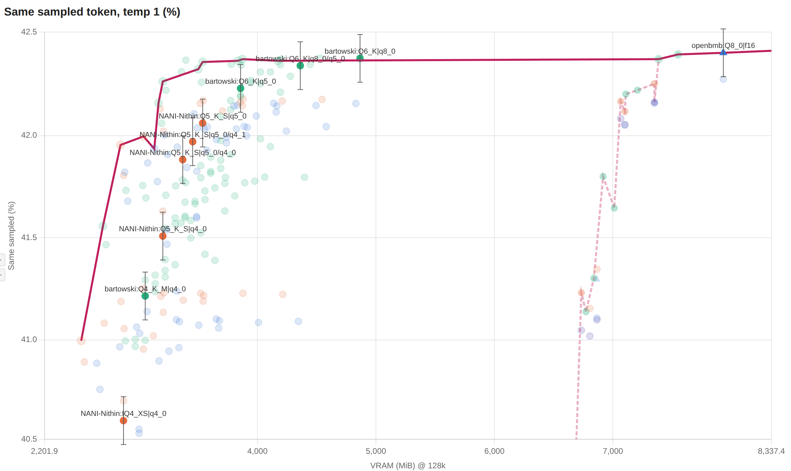
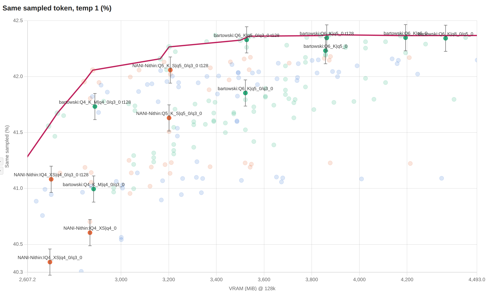
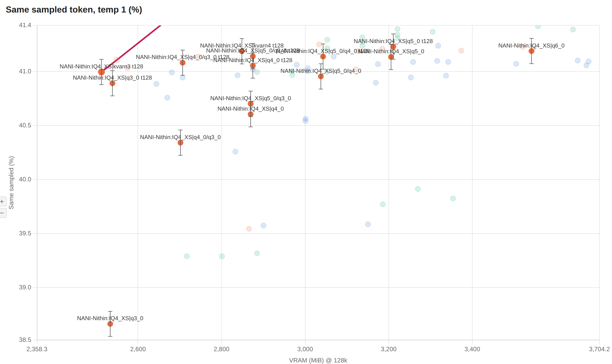
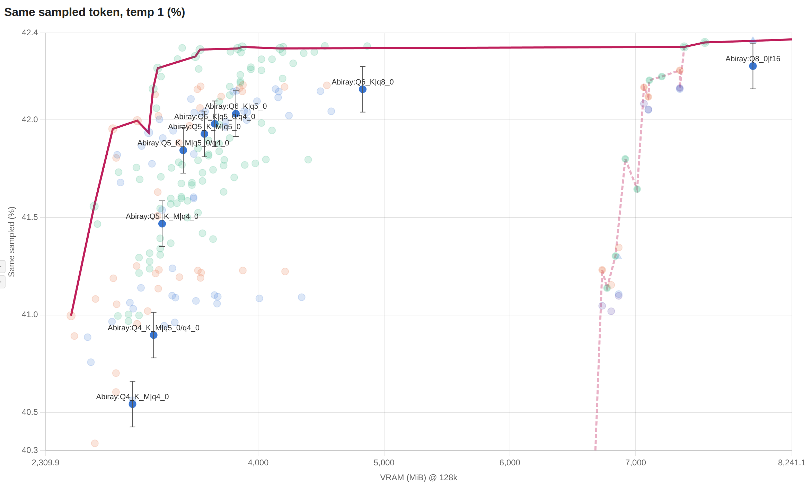
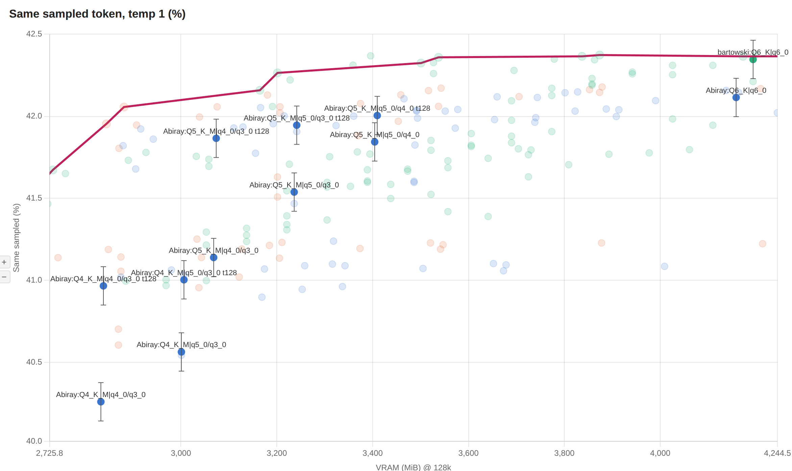

[MiniCPM5-2B](https://huggingface.co/openbmb/MiniCPM5-2B) is a SOTA model for severely memory-constrained devices. I've tested several GGUF collections from HuggingFace, together with the available quantization options for KV cache, to define the frontier of the best quality/size ratios for the model.

The below measures show:

- Mean KLD, for the sake of anchoring to a familiar measure. Note that I'm using a linear scale for the Y axis to highlight the quality cliff.
- Same Sampled Token, from [Quesma's brilliant blog post](https://quesma.com/blog/qwen-quantization-quality/), which is the probability that the model will produce the same token as the baseline when running at temperature=1. This differs from Top-1, which instead runs at temperature=0. It shows the sharpest cliff behaviour among all synthetic measures and highlights outliers that are normally invisible on the Mean KLD report. In Quesma's blog, it is the synthetic measure whose shape most resembles the degradation actually measured by benchmarks (AIME).

## Weights quantization

I've tested the most popular GGUF collections on HuggingFace for the model:

- [openbmb/MiniCPM5-2B-GGUF](https://huggingface.co/openbmb/MiniCPM5-2B-GGUF)
- [bartowski/MiniCPM5-2B-GGUF](https://huggingface.co/bartowski/MiniCPM5-2B-GGUF)
- [NANI-Nithin/MiniCPM5-2B-GGUF](https://huggingface.co/NANI-Nithin/MiniCPM5-2B-GGUF)
- [mradermacher/MiniCPM5-2B-i1-GGUF](https://huggingface.co/mradermacher/MiniCPM5-2B-i1-GGUF)
- [Abiray/MiniCPM5-2B-heretic-abliterated-GGUF](https://huggingface.co/Abiray/MiniCPM5-2B-heretic-abliterated-GGUF)

### Highlights

- **bartowski** is the safe default;
- **NANI-Nithin** allows shedding some extra weight in some cases;
- **Abiray**'s abliteration carries a small cost in quality;
- **mradermacher** and **openbmb** should be avoided as they offer worse performance at all tested size points;
- **Q6_K** is indistinguishable from the F16 baseline;
- **IQ4_XS** shows measurable degradation and is the last useable quant before the Q3 region, which severely harms quality.

In the plots below, the X axis shows the total memory usage for weights + 128k unquantized K/V cache (f16/f16). DSpark drafter and scratch buffers are not included.





## Stock K/V quants

- On stock llama.cpp, `bartowski/MiniCPM5-2B-GGUF:Q6_K` with **q8_0/q8_0** KV cache is indistinguishable from the unquantized model; **q8_0/q5_0** is also almost lossless;
- **q5_0/q5_0** KV cache lets you shed some weight for a small cost. Drop the K/V cache to q5_0/q5_0 first before increasing the quantization of the weights;
- **q5_0/q4_0** shows contained degradation;
- **q4_0/q4_0** is still useable - barely. If it's the only one that fits, you should really consider switching to BeeLlama (read below). Again, you should drop KV cache to q4_0/q4_0 before dropping weights to Q4.



## BeeLlama.cpp K/V quants

- **q6_0/q6_0** is almost lossless and slightly smaller than q8_0/q5_0; **q5_0/q3_0** is strictly better than q4_0/q4_0 for the same size; **q4_0/q3_0** is still useable.
- An exact tail as small as the last 128 tokens drastically uplifts the highest quants, while it has a more modest benefit for larger ones. Whether this uplift actually reflects on real-life performance has yet to be proven. True performance is bounded between the best-case scenario, marked on the plot for t=128, and the worst-case scenario where old tokens are extremely important, which will perform in line with the point for the same quant without tail.
- Increasing the exact tail from 128 to 1024 tokens has a modest cost in size and equally modest performance improvement on the plot. However, it should make the worst-case scenario described above less likely to happen, so it is recommended.



- **q3_0/q3_0** and **kvarn3** sit on the quality/size frontier in these plots - but only thanks to the uplift from the exact tail; their worst-case scenario is catastrophic. They are **not** recommended.
- KVarN offers very little benefit in terms of quality/size compared to the equivalent traditional quants with the same exact tail. Note that KVarN has a minimum implicit exact tail of 128 tokens, so e.g. kvarn4's like-for-like comparison is q4_0/q4_0 with `kv-tail-tokens=128`. On CUDA, KVarN K/V cache was observed to be ~20% slower than traditional quants.

The plot below shows how the gap between best and worst case widens as the quantization increases:



## Abliteration

**Abiray/MiniCPM5-2B-heretic-abliterated-GGUF** had its guardrails removed. Abliteration carries a small cost in terms of logits drift, for all prompts, whether it's needed or not:

Frontier abliterated weights + K/V cache combos on stock llama.cpp:



BeeLlama.cpp:



## Presets

The below .ini files can be loaded with `llama-server --models-preset models.ini`.

No-compromises setup, indistinguishable in quality from the original model, occupying 7.1 GiB VRAM on CUDA, including drafter and scratch buffers:

```ini
[*]
flash-attn = on
kv-unified = true
jinja = true
parallel = 4

[MiniCPM5-2B]
hf = bartowski/MiniCPM5-2B-GGUF:Q6_K

ctx-size = 131072
cache-type-k = q8_0
cache-type-v = q8_0

temperature = 1.0
top-p = 0.95
min-p = 0.0

spec-type = draft-dspark
spec-draft-hf = openbmb/MiniCPM5-2B-DSpark-GGUF:DSpark
spec-draft-ngl = 99
spec-draft-n-max = 7
```

Rock bottom for what is useable without extreme degradation, consuming 3.0 GiB RAM on CPU including executable and scratch buffers, or 3.2 GiB VRAM on CUDA (requires BeeLlama.cpp):

```ini
[*]
flash-attn = on
kv-unified = true
jinja = true
parallel = 1

[MiniCPM5-2B]
hf = NANI-Nithin/MiniCPM5-2B-GGUF:IQ4_XS

ctx-size = 131072
cache-type-k = q4_0
cache-type-v = q3_0
kv-tail-tokens = 1024

temperature = 1.0
top-p = 0.95
min-p = 0.0
```

## Conclusions

MiniCPM5-2B is, as of Sep 15, 2026, [the smartest model that fits in 3 GiB RAM](https://artificialanalysis.ai/models?models=k2-7b-ph2%2Ck2-4b-ph1%2Ck2-mova-36b-mid5%2Cmuse-glimmer%2Cminicpm5-2b%2Cminicpm5-1b%2Cling-3-0-tiny%2Cqwen3-6-35b-a3b%2Cqwen3-8-27b%2Clfm2-5-2-6b&model-size=intelligence-vs-total-parameters#model-size).
It is the smartest model that fits on entry-level laptops, most mobile phones, or on SBCs mounting 4 to 8 GiB RAM. The next incremental upgrade, [K2 Horizon 3.7B](https://huggingface.co/IFM/K2-Horizon-3.7B), requires at least 8 GiB due to its different context design (2.9 GiB for the weights, plus 5 GiB for 128k q4 KV cache) and is substantially slower to run.

MiniCPM5-2B holds weights quantization very well for its size, is very tolerant of low K/V cache quants, and benefits from BeeLlama's low quants and exact tail (but not from KVarN).

Its most notable defect is the lack of vision capabilities; if that's needed one should use [LFM2.5-VL-3B](https://huggingface.co/LiquidAI/LFM2.5-VL-3B), which has comparable RAM requirements but is substantially less intelligent.
