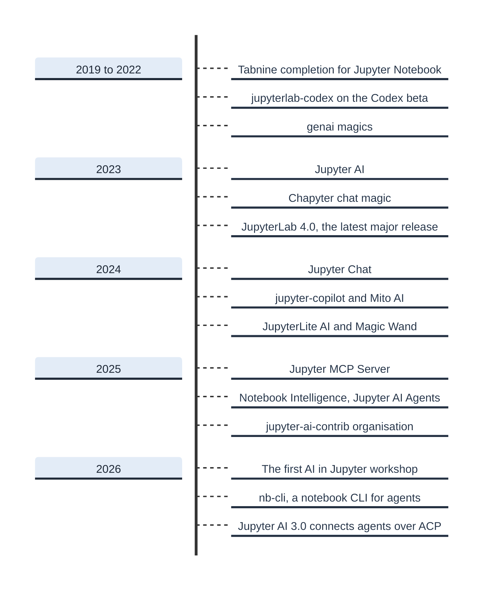

At OpenTeams, my colleagues and I have contributed upstream to AI in Jupyter over the years: from the upstream implementation of inline completion, which shipped in JupyterLab 4.1, through Jupyter AI across all three versions, to JupyterLite AI, which needs no server. We have also always cheered on other efforts to bring AI to Jupyter, whether they came from other maintainers or from new contributors, and whether they were under the official Project Jupyter umbrella or not. Over time the number of extensions grew until it became hard to keep track. The number grew in part because anyone can build an integration: the barrier to entry is low and the Jupyter APIs are stable. We have now collated a systematic catalogue of AI extensions for Jupyter in [openteams-ai/awesome-jupyter-ai](https://github.com/openteams-ai/awesome-jupyter-ai), under CC0, and I want to share a few lessons and observations.

## Navigating the space of Jupyter AI extensions

New AI integrations keep popping up weekly. Many JupyterLab extensions are created to serve users at a university or a specific company, and are rarely announced to the outside world. A quick web search will only find the ones that were loudly marketed, not the ones that were silently maintained for a narrow group of users. This means that the community sometimes lacks a full picture. I would like the community to be able to map out which ideas were already explored and which remain underexplored.

For that reason, we started the list from over 1,200 PyPI packages that carry a JupyterLab classifier, searched them for AI terms and model SDKs, added a few npm and GitHub searches, and screened the licence of each candidate (see [method](https://github.com/openteams-ai/awesome-jupyter-ai/blob/main/CONTRIBUTING.md#how-the-list-was-assembled) for details).

The extension API of JupyterLab has been stable since the 4.0 release, so the list includes extensions developed since. Extensions developed since 2023 usually still work today, as long as the associated AI service has not shut down. We moved the ones that are no longer worked on, or whose service has shut down, to a separate [historical document](https://github.com/openteams-ai/awesome-jupyter-ai/blob/main/HISTORICAL.md). Although we find many of the listed extensions excellent, inclusion is not endorsement.

## What is in the list

The main list has 103 entries in ten sections, and a separate historical file has 19 more:

| Section | What it covers | Entries | Example |
| --- | --- | ---: | --- |
| [Chat panels and agents](https://github.com/openteams-ai/awesome-jupyter-ai#chat-panels-and-agents) | A panel you type into, which can read and edit your notebook | 28 | [Jupyter AI](https://github.com/jupyterlab/jupyter-ai) |
| [Inline completion](https://github.com/openteams-ai/awesome-jupyter-ai#inline-completion) | Ghost text as you type | 6 | [jupyter-copilot](https://github.com/baolong281/jupyter-copilot) |
| [In-cell edits and magics](https://github.com/openteams-ai/awesome-jupyter-ai#in-cell-edits-and-magics) | A cell toolbar button, a magic, or a diff you accept | 6 | [Magic Wand](https://github.com/jupyter-ai-contrib/jupyterlab-magic-wand) |
| [Agent CLI bridges](https://github.com/openteams-ai/awesome-jupyter-ai#agent-cli-bridges) | Claude Code, Codex and other command line agents, connected to the notebook | 6 | [xtralab](https://github.com/jtpio/xtralab) |
| [Domain, teaching and platform](https://github.com/openteams-ai/awesome-jupyter-ai#domain-teaching-and-platform) | Tools for one scientific field, one classroom or one vendor platform | 15 | [Jupyter AI Tutor](https://github.com/QuantStack/jupyter-ai-tutor) |
| [Building blocks: Jupyter AI plugins](https://github.com/openteams-ai/awesome-jupyter-ai#jupyter-ai-plugins) | Personas, routing, model access and the agent protocol client for Jupyter AI v3 | 11 | [jupyter-ai-acp-client](https://github.com/jupyter-ai-contrib/jupyter-ai-acp-client) |
| [Building blocks: chat and notebook UI](https://github.com/openteams-ai/awesome-jupyter-ai#chat-and-notebook-ui) | Chat, diff and notebook components to build your own assistant | 10 | [Jupyter Chat](https://github.com/jupyterlab/jupyter-chat) |
| [Building blocks: live reload](https://github.com/openteams-ai/awesome-jupyter-ai#live-reload) | Update the open notebook when an agent edits the file | 5 | [jupyter-collaboration](https://github.com/jupyterlab/jupyter-collaboration) |
| [Building blocks: MCP](https://github.com/openteams-ai/awesome-jupyter-ai#mcp) | Agents outside JupyterLab, and JupyterLab commands as tools | 7 | [Jupyter MCP Server](https://github.com/datalayer/jupyter-mcp-server) |
| [Beyond the JupyterLab UI](https://github.com/openteams-ai/awesome-jupyter-ai#beyond-the-jupyterlab-ui) | Command line tools, magics and models used next to Jupyter | 9 | [nb-cli](https://github.com/jupyter-ai-contrib/nb-cli) |
| [Historical](https://github.com/openteams-ai/awesome-jupyter-ai/blob/main/HISTORICAL.md) | No commit for two years, archived, or the service is gone | 19 | [Chapyter](https://github.com/chapyter/chapyter) |

## How to choose one

Depending on what you need, this is where I would start:

| If you want | Start with |
| --- | --- |
| A project governed by Project Jupyter | [Jupyter AI](https://github.com/jupyterlab/jupyter-ai), or [JupyterLite AI](https://github.com/jupyterlite/ai) when there is no server |
| The coding agent you already use, such as Claude Code or Codex | Jupyter AI v3, which connects agents over the Agent Client Protocol (ACP), or a CLI bridge such as [xtralab](https://github.com/jtpio/xtralab) |
| An agent outside JupyterLab that edits and runs your notebook | [Jupyter MCP Server](https://github.com/datalayer/jupyter-mcp-server), with an extension from the [live reload](https://github.com/openteams-ai/awesome-jupyter-ai#live-reload) section so that the open notebook shows the changes |
| One assistant that does everything | [Notebook Intelligence](https://github.com/plmbr/notebook-intelligence) for chat, inline edits, completion and an agent (GPL-3.0), or [Mito AI](https://github.com/mito-ds/mito) for chat, error debugging and an agent next to the Mito spreadsheet (mixed licence) |
| Completion as you type | [JupyterLite AI](https://github.com/jupyterlite/ai) if you have API access, [jupyter-copilot](https://github.com/baolong281/jupyter-copilot) for GitHub Copilot, or [jupyterlab-browser-ai](https://github.com/jtpio/jupyterlab-browser-ai), which needs no API key |
| Everything to stay on your machine | [jupyterlab-browser-ai](https://github.com/jtpio/jupyterlab-browser-ai), or [Notebook Intelligence](https://github.com/plmbr/notebook-intelligence) with a local Ollama model |
| AI help for students | [Jupyter AI Tutor](https://github.com/QuantStack/jupyter-ai-tutor) |
| To build your own | the [building blocks](https://github.com/openteams-ai/awesome-jupyter-ai#building-blocks), the personas in [jupyter-ai-demos](https://github.com/jupyter-ai-contrib/jupyter-ai-demos), and [jupyter-vibe-coding](https://github.com/haesleinhuepf/jupyter-vibe-coding), whose code is short enough to read first |

## What the list shows about the ecosystem

Chat panels are the most common interface, with 28 entries. These either use standalone LLM calls or agentic APIs. Coding agents connect from inside JupyterLab in two ways. [Jupyter AI](https://github.com/jupyterlab/jupyter-ai) v3 connects Claude, Codex, GitHub Copilot, Gemini and four more agents over the open Agent Client Protocol, so changing the agent does not mean changing the extension. It asks permission before an agent writes files or runs commands. Six extensions connect the Claude Code and Codex command line tools to the notebook instead, through a side panel, a magic or cell comments.

The Model Context Protocol (MCP) works in both directions. An agent outside JupyterLab can read, write and run cells through an MCP server such as [Jupyter MCP Server](https://github.com/datalayer/jupyter-mcp-server). With [jupyter-mcp-tools](https://github.com/datalayer/jupyter-mcp-tools) installed, Jupyter MCP Server can also run JupyterLab commands, such as opening a notebook. In the other direction, Jupyter AI v3 gives its agents access to the MCP servers you add. Some agents do not use the browser at all, e.g. [nb-cli](https://github.com/jupyter-ai-contrib/nb-cli) gives them a command line for notebooks, with a markdown format written for agents.

Agents made the lack of hot reload a bigger problem. When an agent writes to the `.ipynb` file while the notebook is open, JupyterLab by default keeps showing the old cells. The extensions in the live reload section address this. One solution is to reuse the out-of-band reload of real time collaboration ([jupyter-collaboration](https://github.com/jupyterlab/jupyter-collaboration)), which also enables representing agents as a collaborator present in the UI, the same way as a human colleague. There are several implementations of hot reload, and we [proposed](https://github.com/jupyter-governance/funding-proposals/issues/90) upstreaming lightweight file-change detection to JupyterLab itself, so that it refreshes open documents when their files change.

There is a strong interest in privacy. [jupyterlab-browser-ai](https://github.com/jtpio/jupyterlab-browser-ai) needs no API key: it uses the AI APIs built into Chrome and sends no data off the machine. Others, such as [Notebook Intelligence](https://github.com/plmbr/notebook-intelligence), can run a local model through Ollama.

There is a growing set of packages for research and teaching. [InstrMCP](https://github.com/caidish/instrMCP) lets a model read physics lab instruments through QCodes, and [Jupyter AI Tutor](https://github.com/QuantStack/jupyter-ai-tutor) adds an Explain Code button for students. Research prototypes come from Microsoft Research ([CoML](https://github.com/microsoft/CoML)), Georgia Tech ([LLM Attributor](https://github.com/poloclub/LLM-Attributor)) and a CHI'25 paper ([Xavier](https://github.com/CHI25-Xavier/Xavier)).

Standalone inline completion is not as popular anymore. The inline completion API makes the feature easy to maintain, and it ships as part of JupyterLite AI and Notebook Intelligence, among others.

## The timeline

The ecosystem is the work of a wide community. These are some of its milestones:

The first [AI in Jupyter workshop](https://events.linuxfoundation.org/ai-in-jupyter/) brought contributors together in Paris and Seattle in March 2026 to work on a shared, extensible framework for AI in notebooks. The [Jupyter AI Developer Summits](https://jupyterfoundation.org/event/jupyter-ai-developer-summits/), in San Francisco and London. Both were funded by the [Jupyter Foundation](https://jupyterfoundation.org/), and I attended both for OpenTeams. I am looking forward to the next summit, and would love to connect with more of the wider community there.

## Lessons about choosing wisely

Earlier attempts show what did not stand the test of time. I believe that relying on open-source providers, models and code gives a better outcome in the long term than chasing the latest pitch from a closed-source vendor, or from a fork that fenced itself off. Looking back, I think there are strong arguments that confirm it:

1. In 2024, [Pretzel](https://github.com/pretzelai/pretzelai) hard-forked JupyterLab 4.2 to add AI features, and licensed its changes under AGPLv3, so BSD-licensed JupyterLab could not take them upstream. Development stopped the same year. Since then, JupyterLab has published ten security advisories that affect 4.2, four of them rated high, and Pretzel users got none of the fixes. It was a lose-lose scenario.
2. Kite's JupyterLab extension, one of the first AI extensions for JupyterLab, started in 2020 as a copy of my [jupyterlab-lsp](https://github.com/jupyter-lsp/jupyterlab-lsp). The copy was last updated in 2021 and Kite shut down in 2022, while jupyterlab-lsp is still maintained.
3. When a vendor changes course, work on its extension stops. Tabnine's JupyterLab client stopped two months after its first release and is now archived. Codeium's own client has not changed since 2024, and Codeium is now Windsurf. Einblick was acquired, and its prompt extension is still on PyPI while the source repository returns 404.
4. Open code and open models outlive the service. IBM discontinued the Qiskit Code Assistant service in 2026 and archived its JupyterLab extension, but the models are on Hugging Face under Apache-2.0, and the extension still supports Ollama and any OpenAI-compatible endpoint. Noteable shut down in 2023, and genai, the BSD-licensed IPython magics written there, is still maintained.

## Before you install

Some common pitfalls:

1. Cross-check the licence in the PyPI classifier against the LICENSE file inside the wheel. Some extensions disagree, probably because the extension template fills in both places. RunCell's classifier says BSD, for example, but its LICENSE file is a copyright line with no grant. Notebook Intelligence and ai-jup are GPL-3.0, and Mito AI has a mixed licence, so check your distribution rules before you bundle them.
2. Some packages have no public source: all you get is the bundled code in the wheel, which is hard to read. Do not trust the package name alone either: some extensions reuse the name of another project on GitHub, and some publish under similar names on PyPI. Check whether the package uses trusted publishing, which PyPI shows as a verified repository link. It does not make the package safe, but it ties the package to its source repository.
3. How agents authenticate, and how extensions handle API keys, is not settled yet. Before you deploy an extension, check what it exposes and how it handles keys. For example, jupyter-copilot disables authentication on its server extension, so do not use it over SSH. Reach out if you need advice from a Jupyter expert.

## Please add what is missing and leave a star

You are welcome to open a pull request that adds an extension, your own or someone else's, or that updates any entry. Listing your own project is fine; just say so in the pull request. A project that has been public for less than a month, or has no readme that explains how to install it, will be asked to wait. See [CONTRIBUTING.md](https://github.com/openteams-ai/awesome-jupyter-ai/blob/main/CONTRIBUTING.md) for more.

A big shout-out to Jeremy Tuloup, who was the first to add a new package: xtralab, in [pull request #1](https://github.com/openteams-ai/awesome-jupyter-ai/pull/1).

If you like the list, star [the repository](https://github.com/openteams-ai/awesome-jupyter-ai). It lets us know, and it makes the list easier to find in the future.
