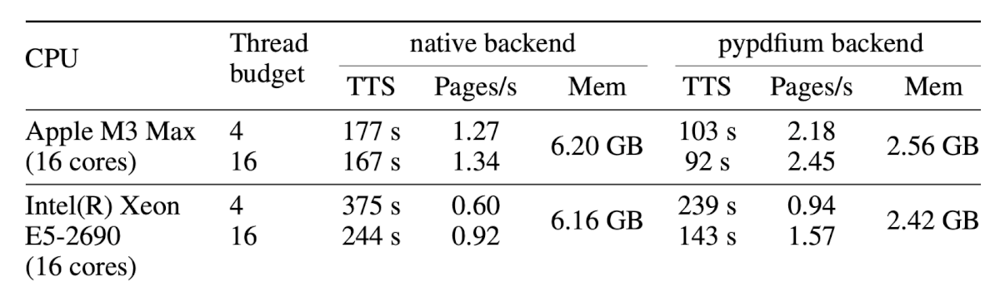
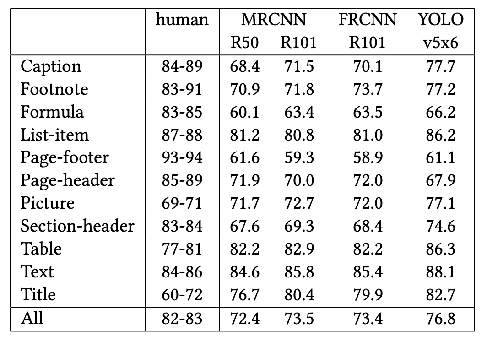
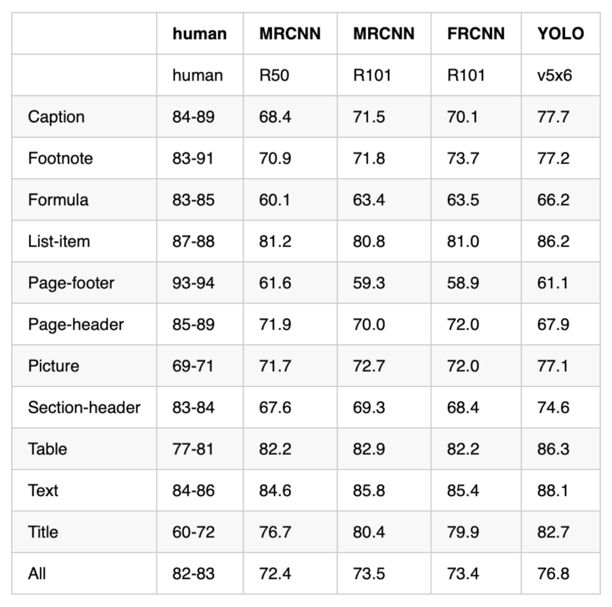
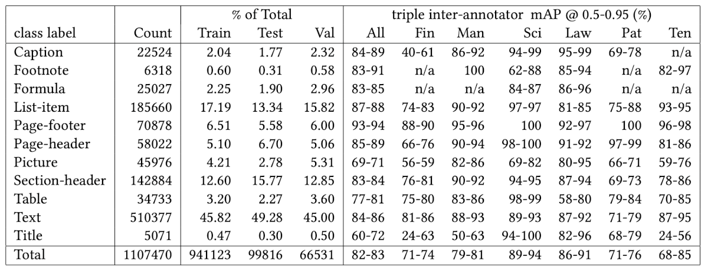
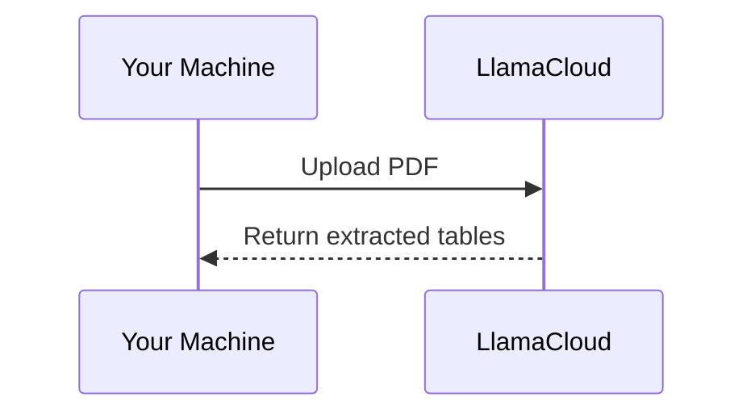

## Introduction

Have you ever copied a table from a PDF into a spreadsheet only to find the formatting completely broken? These issues include cells shifting, values landing in the wrong columns, and merged headers losing their structure.

This happens because PDFs do not store tables as structured data. They simply place text at specific coordinates on a page.

For example, a table that looks like this on screen:

```
┌───────┬───────┐
│ Name  │ Score │
├───────┼───────┤
│ Alice │  92   │
│ Bob   │  85   │
└───────┴───────┘
```

is stored in the PDF as a flat list of positioned text:

```
"Name"  at (x=72,  y=710)
"Score" at (x=200, y=710)
"Alice" at (x=72,  y=690)
"92"    at (x=200, y=690)
"Bob"   at (x=72,  y=670)
"85"    at (x=200, y=670)
```

A table extraction tool must analyze those positions, determine which text belongs in each cell, and rebuild the table structure.

The challenge becomes even greater with multi-level headers, merged cells, or tables that span multiple pages. Many tools struggle with at least one of these scenarios.

While doing research, I came across three Python tools for extracting tables from PDFs: Docling, Marker, and LlamaParse. To compare them fairly, I ran each tool on the same PDF and evaluated the results.

In this article, I'll walk through what I found and help you decide which tool may work best for your needs.

> The complete source code and Jupyter notebook for this tutorial are available on [GitHub](https://github.com/khuyentran1401/codecut-blog/blob/main/docling-vs-marker-vs-llamaparse.ipynb). Clone it to follow along.

## The Test Document

All examples use the same PDF: the [Docling Technical Report](https://arxiv.org/pdf/2408.09869) from arXiv. This paper contains tables with the features that make extraction difficult:

- Multi-level headers with sub-columns
- Merged cells spanning multiple rows
- Numeric data that is easy to misalign

```python
source = "https://arxiv.org/pdf/2408.09869"
```

Some tools require a local file path instead of a URL, so let's download the PDF first:

```python
import urllib.request

# Download PDF locally (used by Marker later)
local_pdf = "docling_report.pdf"
urllib.request.urlretrieve(source, local_pdf)
```

## Docling: TableFormer Deep Learning

[Docling](https://github.com/docling-project/docling) is IBM's open-source document converter built specifically for structured extraction. Its table pipeline works in two steps:

- **Detect table regions** using a layout analysis model that finds tables, text, and figures on each page
- **Reconstruct cell structure** using TableFormer, a deep learning model that maps each cell to its row and column position

Here is what that looks like in practice:

```
PDF page with mixed content
┌─────────────────────┐
│ Text paragraph...   │
│ Name  Score         │
│ Alice  92           │
│ Bob    85           │
│ (figure)            │
└─────────────────────┘
         │
         ▼
Step 1: Layout model detects table region
┌─────────────────────┐
│ ┌─────────────────┐ │
│ │ Name  Score     │ │
│ │ Alice  92       │ │
│ │ Bob    85       │ │
│ └─────────────────┘ │
└─────────────────────┘
         │
         ▼
Step 2: TableFormer maps cells to rows and columns
┌───────┬───────┐
│ Name  │ Score │
├───────┼───────┤
│ Alice │  92   │
│ Bob   │  85   │
└───────┴───────┘
```

The result is a pandas DataFrame for each table, ready for analysis.

> For Docling's full document processing capabilities beyond tables, including chunking and RAG integration, see [Transform Any PDF into Searchable AI Data with Docling](https://codecut.ai/docling-pdf-rag-document-processing/).

To install Docling, run:

```bash
pip install docling
```

*This article uses docling v2.63.0.*

### Table Extraction

To extract tables from the PDF, we need to first convert it to a Docling document using `DocumentConverter`:

```python
from docling.document_converter import DocumentConverter

# Convert PDF
converter = DocumentConverter()
result = converter.convert(source)
```

Once we have the Docling document, we can loop through all detected tables and export each one as a pandas DataFrame:

```python
for i, table in enumerate(result.document.tables):
    df = table.export_to_dataframe(doc=result.document)
    print(f"Table {i + 1}: {df.shape[0]} rows × {df.shape[1]} columns")
```

```
Table 1: 2 rows × 8 columns
Table 2: 1 rows × 5 columns
Table 3: 0 rows × 0 columns
```

The PDF contains 5 tables, but Docling only detected 3.

Table 3 returned 0 rows. This means the layout model flagged it as a table but TableFormer couldn't extract any structure from it.

Let's look at the first table. Here's the original from the PDF:



And here's what Docling extracted:

```python
# Export the first table as a DataFrame
table_1 = result.document.tables[0]
df_1 = table_1.export_to_dataframe(doc=result.document)
df_1
```

| CPU | Thread budget | native TTS | native Pages/s | native Mem | pypdfium TTS | pypdfium Pages/s | pypdfium Mem |
|---|---|---|---|---|---|---|---|
| Apple M3 Max (16 cores) | 4 16 | 177 s 167 s | 1.27 1.34 | 6.20 GB | 103 s 92 s | 2.18 2.45 | 2.56 GB |
| Intel(R) Xeon E5-2690 | 4 16 | 375 s 244 s | 0.60 0.92 | 6.16 GB | 239 s 143 s | 0.94 1.57 | 2.42 GB |

Notice how Docling handles this complex table:

- Docling smartly handled the multi-level header by flattening it into separate columns ("native backend" turned into "native TTS", "native Pages/s", "native Mem").
- However, it merged each CPU's two thread-budget rows into one, packing values like "177 s 167 s" into single cells.

Now the second table. Here's the original from the PDF:



And here's what Docling extracted:

```python
# Export the second table as a DataFrame
table_2 = result.document.tables[1]
df_2 = table_2.export_to_dataframe(doc=result.document)
df_2
```

| human | MRCNN R50 R101 | FRCNN R101 | YOLO v5x6 | 0 |
|---|---|---|---|---|
| Caption Footnote Formula List-item Page-footer… | 84-89 83-91 83-85 87-88 93-94 85-89 69-71 83-8… | 68.4 71.5 70.9 71.8 60.1 63.4 81.2 80.8 61.6 5… | 70.1 73.7 63.5 81.0 58.9 72.0 72.0 68.4 82.2 8… |  |

We can see that Docling did not handle this table as well as the first one:

- Docling merged the MRCNN sub-columns (R50, R101) into a single "MRCNN R50 R101" column instead of two separate ones.
- All 13 rows were collapsed into one, concatenating values like "68.4 71.5 70.9…" into a single cell.

Complex tables with multi-level headers and merged cells remain a challenge for Docling's table extraction.

### Performance

Docling took about 28 seconds for the full 6-page PDF on an Apple M1 (16 GB RAM), thanks to its lightweight two-stage pipeline.

## Marker: Vision Transformer Pipeline

[Marker](https://github.com/datalab-to/marker) is an open-source PDF-to-Markdown converter built on the Surya layout engine. Unlike Docling's two-stage pipeline, Marker runs five stages for table extraction:

- **Layout detection**: a Vision Transformer identifies table regions on each page
- **OCR error detection**: flags misrecognized text
- **Bounding box detection**: locates individual cell boundaries
- **Table recognition**: reconstructs row/column structure from detected cells
- **Text recognition**: extracts text from all detected regions

Here is how the five stages work together:

```
PDF page
┌─────────────────────┐
│ Text paragraph...   │
│ Name  Score         │
│ Alice  92           │
│ Bob    85           │
└─────────────────────┘
         │
         ▼
1. Layout detection → finds [TABLE] region
2. OCR error detection → fixes misread text
         │
         ▼
3. Bounding box detection
┌──────────────────┐
│ [Name]  [Score]  │
│ [Alice] [92]     │
│ [Bob]   [85]     │
└──────────────────┘
         │
         ▼
4. Table recognition → maps cells to rows/columns
5. Text recognition → extracts final text
         │
         ▼
| Name  | Score |
|-------|-------|
| Alice | 92    |
| Bob   | 85    |
```

To install Marker, run:

```bash
pip install marker-pdf
```

### Table Extraction

Marker provides a dedicated `TableConverter` that extracts only tables from a document, returning them as Markdown:

```python
from marker.converters.table import TableConverter
from marker.models import create_model_dict
from marker.output import text_from_rendered

models = create_model_dict()
converter = TableConverter(artifact_dict=models)
rendered = converter(local_pdf)
table_md, _, images = text_from_rendered(rendered)
```

Since `TableConverter` returns all tables as a single Markdown string, we split them on blank lines:

```python
tables = table_md.strip().split("\n\n")
print(f"Tables found: {len(tables)}")
```

```
Tables found: 3
```

Let's look at the first table. Here's the original from the PDF:


And here's what Marker extracted:

```python
print(tables[0].md)
```

| CPU | Thread | native backend | pypdfium backend |
|---|---|---|---|
|  | budget | TTS | Pages/s | Mem | TTS | Pages/s | Mem |
| Apple M3 Max&lt;br&gt;(16 cores) | 4&lt;br&gt;16 | 177 s&lt;br&gt;167 s | 1.27&lt;br&gt;1.34 | 6.20 GB | 103 s&lt;br&gt;92 s | 2.18&lt;br&gt;2.45 | 2.56 GB |
| Intel(R) Xeon&lt;br&gt;E5-2690&lt;br&gt;(16 cores) | 4&lt;br&gt;16 | 375 s&lt;br&gt;244 s | 0.60&lt;br&gt;0.92 | 6.16 GB | 239 s&lt;br&gt;143 s | 0.94&lt;br&gt;1.57 | 2.42 GB |

Marker preserves the original table format well:

- While Docling flattened this into prefixed column names like "native TTS", Marker preserves the two-tier header ("native backend" with TTS, Pages/s, Mem) as separate rows, keeping the parent header visible.
- While Docling packed these into single strings like "177 s 167 s" without separators, Marker preserves the distinction between values by using `<br>` tags, making it easy to split them programmatically later with a simple string split.

Let's look at the second table. Here's the original from the PDF:


And here's what Marker extracted:

```python
print(tables[1].md)
```

| human&lt;br&gt;MRCNN | FRCNN YOLO |
|---|---|
| R50 R101 | R101 | v5x6 |
| Caption | 84-89 68.4 71.5 | 70.1 | 77.7 |
| Footnote | 83-91 70.9 71.8 | 73.7 | 77.2 |
| Formula | 83-85 60.1 63.4 | 63.5 | 66.2 |
| List-item | 87-88 81.2 80.8 | 81.0 | 86.2 |
| Page-footer | 93-94 61.6 59.3 | 58.9 | 61.1 |
| Page-header | 85-89 71.9 70.0 | 72.0 | 67.9 |
| Picture | 69-71 71.7 72.7 | 72.0 | 77.1 |
| Section-header | 83-84 67.6 69.3 | 68.4 | 74.6 |
| Table | 77-81 82.2 82.9 | 82.2 | 86.3 |
| Text | 84-86 84.6 85.8 | 85.4 | 88.1 |
| Title | 60-72 76.7 80.4 | 79.9 | 82.7 |
| All | 82-83 72.4 73.5 | 73.4 | 76.8 |

This table has several column-merging issues:

- "human" and "MRCNN" are merged into one header (`human<br>MRCNN`), and "FRCNN" and "YOLO" are combined into a single header (`FRCNN YOLO`).
- The human, MRCNN R50, and MRCNN R101 values are packed into one cell ("84-89 68.4 71.5"), while the MRCNN R50 and R101 columns are empty.
- The R50 and R101 sub-columns collapsed into a single "R50 R101" cell.

Despite these issues, Marker still preserves all 12 rows individually, while Docling collapsed them into one.

Let's look at the third table. Here's the original from the PDF:



And here's what Marker extracted:

```python
print(tables[2].md)
```

| human | MRCNN | MRCNN | FRCNN | YOLO |
|---|---|---|---|---|
|  | R50 | R101 | R101 | v5x6 |
| Caption | 84-89 | 68.4 | 71.5 | 70.1 | 77.7 |
| Footnote | 83-91 | 70.9 | 71.8 | 73.7 | 77.2 |
| Formula | 83-85 | 60.1 | 63.4 | 63.5 | 66.2 |
| List-item | 87-88 | 81.2 | 80.8 | 81.0 | 86.2 |
| Page-footer | 93-94 | 61.6 | 59.3 | 58.9 | 61.1 |
| Page-header | 85-89 | 71.9 | 70.0 | 72.0 | 67.9 |
| Picture | 69-71 | 71.7 | 72.7 | 72.0 | 77.1 |
| Section-header | 83-84 | 67.6 | 69.3 | 68.4 | 74.6 |
| Table | 77-81 | 82.2 | 82.9 | 82.2 | 86.3 |
| Text | 84-86 | 84.6 | 85.8 | 85.4 | 88.1 |
| Title | 60-72 | 76.7 | 80.4 | 79.9 | 82.7 |
| All | 82-83 | 72.4 | 73.5 | 73.4 | 76.8 |

Since the layout of this table is simpler, Marker's vision model correctly separates all columns and preserves all 12 rows. This shows that Marker's accuracy depends heavily on the visual complexity of the original table.

### Performance

`TableConverter` took about 6 minutes on an Apple M1 (16 GB RAM), roughly 13x slower than Docling. The speed difference comes down to how each tool handles text:

- **Docling** extracts text that is already stored in the PDF, skipping OCR. It only runs its layout model and TableFormer on detected tables.
- **Marker** runs Surya's full text recognition model on every page, regardless of whether the PDF already contains selectable text.

## LlamaParse: LLM-Guided Extraction

[LlamaParse](https://github.com/run-llama/llama_cloud_services) is a cloud-hosted document parser by LlamaIndex that takes a different approach:

- **Cloud-based**: the PDF is uploaded to LlamaCloud instead of being processed locally
- **LLM-guided**: an LLM interprets each page and identifies tables, returning structured row data

Here is how it works:

```
PDF file
┌─────────────────────┐
│ Name  Score         │
│ Alice  92           │
│ Bob    85           │
└─────────────────────┘
         │
         ▼ upload
┌─────────────────────┐
│     LlamaCloud      │
│                     │
│  LLM reads the page │
│  and identifies     │
│  table structure    │
└─────────────────────┘
         │
         ▼ response
┌───────┬───────┐
│ Name  │ Score │
├───────┼───────┤
│ Alice │  92   │
│ Bob   │  85   │
└───────┴───────┘
```

> For extracting structured data from images like receipts using the same LlamaIndex ecosystem, see [Turn Receipt Images into Spreadsheets with LlamaIndex](https://codecut.ai/llamaindex-receipt-data-extraction/).

To install LlamaParse, run:

```bash
pip install llama-parse
```

*This article uses llama-parse v0.6.54.*

LlamaParse requires an API key from [LlamaIndex Cloud](https://cloud.llamaindex.ai/api-key). The free tier includes 10,000 credits per month (basic parsing costs 1 credit per page; advanced modes like `parse_page_with_agent` cost more).

Create a `.env` file with your API key:

```
LLAMA_CLOUD_API_KEY=llx-...
```

```python
from dotenv import load_dotenv

load_dotenv()
```

### Table Extraction

To extract tables, we create a `LlamaParse` instance with two key settings:

- `parse_page_with_agent`: tells LlamaCloud to use an LLM agent that reads each page and returns structured items (tables, text, figures)
- `output_tables_as_HTML=True`: returns tables as HTML instead of Markdown, which better preserves multi-level headers

```python
from llama_cloud_services import LlamaParse

parser = LlamaParse(
    parse_mode="parse_page_with_agent",
    output_tables_as_HTML=True,
)
result = parser.parse(local_pdf)
```

We can then iterate through each page's items and collect only the tables:

```python
all_tables = []
for page in result.pages:
    for item in page.items:
        if item.type == "table":
            all_tables.append(item)

print(f"Items tagged as table: {len(all_tables)}")
```

```
Items tagged as table: 5
```

Not all items tagged as "table" are actual tables. LlamaParse's LLM sometimes misidentifies non-table content (like the paper's title page) as a table. We can filter these out by keeping only tables with more than 2 rows:

```python
tables = [t for t in all_tables if len(t.rows) > 2]
print(f"Actual tables: {len(tables)}")
```

```
Actual tables: 4
```

Let's look at the first table. Here's the original from the PDF:


And here's what LlamaParse extracted:

```python
print(tables[0].md)
```

| CPU | Threadbudget | native backend&lt;br/&gt;TTS | native backend&lt;br/&gt;Pages/s | native backend&lt;br/&gt;Mem | pypdfium backend&lt;br/&gt;TTS | pypdfium backend&lt;br/&gt;Pages/s | pypdfium backend&lt;br/&gt;Mem |
|---|---|---|---|---|---|---|---|
| Apple M3 Max&lt;br/&gt;(16 cores) | 4 | 177 s | 1.27 | 6.20 GB | 103 s | 2.18 | 2.56 GB |
|  | 16 | 167 s | 1.34 |  | 92 s | 2.45 |  |
| Intel(R) Xeon&lt;br/&gt;E5-2690&lt;br/&gt;(16 cores) | 4 | 375 s | 0.60 | 6.16 GB | 239 s | 0.94 | 2.42 GB |
|  | 16 | 244 s | 0.92 |  | 143 s | 1.57 |  |

LlamaParse produces the best result for this table among the three tools:

- All values are correctly placed in individual cells. Docling packed multiple values like "177 s 167 s" into single strings, and Marker split multi-line CPU names across extra rows.
- Multi-line entries like "Apple M3 Max / (16 cores)" stay in one cell via `<br/>` tags, avoiding Marker's row-splitting issue.
- The two-tier header is flattened into `native backend<br/>TTS` rather than kept as separate rows like Marker, but the grouping is still readable.

Let's look at the second table. Here's the original from the PDF:


And here's what LlamaParse extracted:

```python
print(tables[1].md)
```

| human | MRCNN&lt;br/&gt;R50 | MRCNN&lt;br/&gt;R101 | FRCNN&lt;br/&gt;R101 | YOLO&lt;br/&gt;v5x6 |
|---|---|---|---|---|
| Caption | 84-89 | 68.4 | 71.5 | 70.1 | 77.7 |
| Footnote | 83-91 | 70.9 | 71.8 | 73.7 | 77.2 |
| Formula | 83-85 | 60.1 | 63.4 | 63.5 | 66.2 |
| List-item | 87-88 | 81.2 | 80.8 | 81.0 | 86.2 |
| Page-footer | 93-94 | 61.6 | 59.3 | 58.9 | 61.1 |
| Page-header | 85-89 | 71.9 | 70.0 | 72.0 | 67.9 |
| Picture | 69-71 | 71.7 | 72.7 | 72.0 | 77.1 |
| Section-header | 83-84 | 67.6 | 69.3 | 68.4 | 74.6 |
| Table | 77-81 | 82.2 | 82.9 | 82.2 | 86.3 |
| Text | 84-86 | 84.6 | 85.8 | 85.4 | 88.1 |
| Title | 60-72 | 76.7 | 80.4 | 79.9 | 82.7 |
| All | 82-83 | 72.4 | 73.5 | 73.4 | 76.8 |

LlamaParse produces the most accurate extraction of this table among the three tools:

- All 12 data rows are preserved with correct values. Docling merged all rows into a single row.
- Each column is correctly separated, while Marker merged some into combined headers like "FRCNN YOLO".
- The MRCNN sub-columns (R50, R101) use `<br/>` tags to keep the parent header visible (e.g., `MRCNN<br/>R50`), unlike Marker which lost the grouping entirely.

Let's look at the third table. Here's the original from the PDF:


And here's what LlamaParse extracted:

```python
print(tables[2].md)
```

| human | R50 | R100 | R101 | v5x6 |
|---|---|---|---|---|
| Caption | 84-89 | 68.4 | 71.5 | 70.1 | 77.7 |
| Footnote | 83-91 | 70.9 | 71.8 | 73.7 | 77.2 |
| Formula | 83-85 | 60.1 | 63.4 | 63.5 | 66.2 |
| List-item | 87-88 | 81.2 | 80.8 | 81.0 | 86.2 |
| Page-footer | 93-94 | 61.6 | 59.3 | 58.9 | 61.1 |
| Page-header | 85-89 | 71.9 | 70.0 | 72.0 | 67.9 |
| Picture | 69-71 | 71.7 | 72.7 | 72.0 | 77.1 |
| Section-header | 83-84 | 67.6 | 69.3 | 68.4 | 74.6 |
| Table | 77-81 | 82.2 | 82.9 | 82.2 | 86.3 |
| Text | 84-86 | 84.6 | 85.8 | 85.4 | 88.1 |
| Title | 60-72 | 76.7 | 80.4 | 79.9 | 82.7 |

The data values are correct but header information is partially lost:

- Parent model names (MRCNN, FRCNN, YOLO) are stripped from headers, unlike the previous table which used `<br/>` tags to preserve them.
- "MRCNN R101" appears as "R100" (a typo), and the two R101 columns (MRCNN and FRCNN) are indistinguishable.
- Marker handled this table better, keeping all 12 rows with proper column names. Docling missed this table entirely.

Unlike Docling and Marker, LlamaParse actually detects the fourth table. Here's the original from the PDF:



And here's what LlamaParse extracted:

```python
print(tables[3].md)
```

| class label | Count | % of TotalTrain | % of TotalTest | % of TotalVal | triple inter-annotator mAP @ 0.5-0.95 (%)&lt;br/&gt;All | triple inter-annotator mAP @ 0.5-0.95 (%)&lt;br/&gt;Fin | triple inter-annotator mAP @ 0.5-0.95 (%)&lt;br/&gt;Man | triple inter-annotator mAP @ 0.5-0.95 (%)&lt;br/&gt;Sci | triple inter-annotator mAP @ 0.5-0.95 (%)&lt;br/&gt;Law | triple inter-annotator mAP @ 0.5-0.95 (%)&lt;br/&gt;Pat | triple inter-annotator mAP @ 0.5-0.95 (%)&lt;br/&gt;Ten |
|---|---|---|---|---|---|---|---|---|---|---|---|
| Caption | 22524 | 2.04 | 1.77 | 2.32 | 84-89 | 40-61 | 86-92 | 94-99 | 95-99 | 69-78 | n/a |
| Footnote | 6318 | 0.60 | 0.31 | 0.58 | 83-91 | n/a | 100 | 62-88 | 85-94 | n/a | 82-97 |
| Formula | 25027 | 2.25 | 1.90 | 2.96 | 83-85 | n/a | n/a | 84-87 | 86-96 | n/a | n/a |
| List-item | 185660 | 17.19 | 13.34 | 15.82 | 87-88 | 74-83 | 90-92 | 97-97 | 81-85 | 75-88 | 93-95 |
| Page-footer | 70878 | 6.51 | 5.58 | 6.00 | 93-94 | 88-90 | 95-96 | 100 | 92-97 | 100 | 96-98 |
| Page-header | 58022 | 5.10 | 6.70 | 5.06 | 85-89 | 66-76 | 90-94 | 98-100 | 91-92 | 97-99 | 81-86 |
| Picture | 45976 | 4.21 | 2.78 | 5.31 | 69-71 | 56-59 | 82-86 | 69-82 | 80-95 | 66-71 | 59-76 |
| Section-header | 142884 | 12.60 | 15.77 | 12.85 | 83-84 | 76-81 | 90-92 | 94-95 | 87-94 | 69-73 | 78-86 |
| Table | 34733 | 3.20 | 2.27 | 3.60 | 77-81 | 75-80 | 83-86 | 98-99 | 58-80 | 79-84 | 70-85 |
| Text | 510377 | 45.82 | 49.28 | 45.00 | 84-86 | 81-86 | 88-93 | 89-93 | 87-92 | 71-79 | 87-95 |
| Title | 5071 | 0.47 | 0.30 | 0.50 | 60-72 | 24-63 | 50-63 | 94-100 | 82-96 | 68-79 | 24-56 |
| Total | 1107470 | 941123 | 99816 | 66531 | 82-83 | 71-74 | 79-81 | 89-94 | 86-91 | 71-76 | 68-85 |

LlamaParse correctly extracts all 12 data rows plus the Total row with accurate values:

- The two-tier headers are flattened into combined names like "% of TotalTrain", losing the visual grouping but keeping the association.
- The "triple inter-annotator mAP" prefix is repeated for every sub-column (All, Fin, Man, etc.), making headers verbose but unambiguous.
- All numeric values and n/a entries match the original.

### Performance

LlamaParse finished in 17 seconds, roughly 40% faster than Docling (28s) and 20x faster than Marker (6 min).

This is because LlamaParse offloads the work to LlamaCloud's servers:



The 17-second runtime depends on network speed and server load, not your local hardware.

## Summary

The table below summarizes the key differences we found after testing all three tools on the same PDF:

| Feature | Docling | Marker | LlamaParse |
|---|---|---|---|
| **Table detection** | TableFormer | Vision Transformer | LLM (cloud) |
| **Multi-level headers** | Flattens into prefixed names | Keeps as separate rows | Preserves with `<br/>` tags |
| **Row separation** | Concatenates into one cell | Separates with `<br>` tags | Keeps each value in its own cell |
| **Speed (6-page PDF)** | ~28s | ~6 min | ~17s |
| **Dependencies** | PyTorch + models | PyTorch + models | API key |
| **Pricing** | Free (MIT) | Free (GPL-3.0) | Free tier (10k credits/month) |

In short:

- **Docling** is the fastest local option and gives you DataFrames out of the box, but it struggles with complex tables, sometimes merging rows and packing values together.
- **Marker** preserves rows reliably and runs locally, but it is the slowest and can merge column headers on tricky layouts.
- **LlamaParse** produces the most accurate tables overall, but it requires a cloud API and the free tier is limited to 10,000 credits per month.

So which one should you use?

- For simple tables, start with Docling. It is free, fast, and produces DataFrames that are immediately ready for analysis.
- If you must stay local and Docling struggles with the layout, Marker is the better alternative.
- Use LlamaParse when accuracy matters most and your documents aren't sensitive, since all pages are uploaded to LlamaCloud for processing.

## Try It Yourself

These benchmarks are based on a single academic PDF tested on an Apple M1 (16 GB RAM). Table complexity, document length, and hardware all affect the results. The best way to pick the right tool is to run each one on a sample of your own PDFs.

Docling and Marker are completely free, and LlamaParse's free tier gives you 10,000 credits per month to experiment with.
