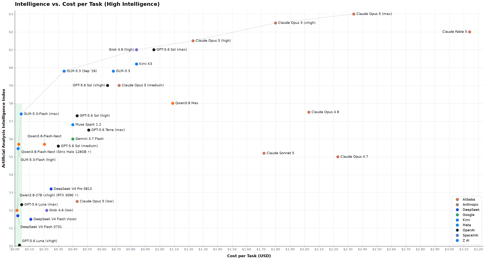
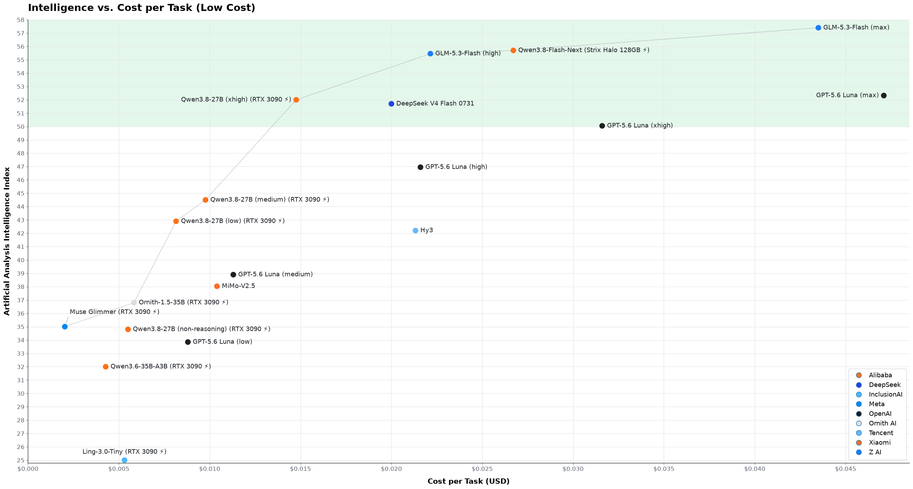
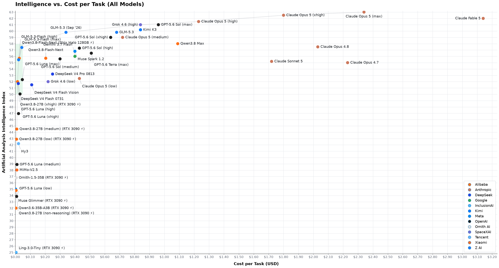

I think that [ArtificialAnalysis's intelligence/cost
plot](https://artificialanalysis.ai/#intelligence-comparison-tabs) is seriously
misleading - read below for why - so I decided to make my own.

Points are at max thinking where not explicitly stated. All intelligence index scores
are from AA. All cost scores are from AA too except where noted below.

Zoom into the bottom-left corner and add more local models. The ⚡ symbol means
electricity cost to run a local model, which is proportional to the time per task given
the same hardware (details below). The area displayed by both plots is highlighted in green.

The two above plots merged together, to better visualize the diminishing returns in
performance/cost. Again the area that's common to all plots is highlighted in green.

## Why AA's plot is misleading

- It uses the official pricing from the model developers' own API offering which, for
  GLM and DeepSeek V4 Flash, is a lot more expensive than what you can get them for on
  OpenRouter;
- It does not make you appreciate the immensity of the price difference between the
  cheap models and the heavy ones;
- It does not make you appreciate how inconsequential the price differences are between
  the cheap models.

## What changes between AA's plot and mine

- Changed X scale from logarithmic to linear, because people's money is not logarithmic
- Changed DeepSeek V4 Flash 0731, GLM-5.3-Flash, and Hy3 to the price you can get them
  for on OpenRouter (excessively slow or unreliable providers and those without
  Zero Data Retention policies are excluded). Note that you don't get these prices with
  OpenCode Go/Zen.
- Added GLM-5.3 as it is expected to be priced by third party providers on OpenRouter in
  September 2026, assuming no license changes from 5.2.
- Extrapolated points for GLM-5.3-Flash at High reasoning effort by crossing AA scores
  at Max with [Z.ai's coding scores](https://z.ai/blog/glm-5.3-flash) at different
  effort levels
- Changed cost of sub-35 billion parameters models from datacenter pricing (which nobody
  realistically will ever use) to cost to run locally.
- Added Ornith-1.5-35B. The intelligence score is extrapolated from _self-reported_
  benchmark results by the model authors and should be taken with a healthy dose of
  skepticism.

## Cost calculation for local models

Cost per task for models marked with ⚡ was crudely calculated as follows:

- Take Output tok/task [from
  artificialanalysis.ai](https://artificialanalysis.ai/#intelligence-comparison-tabs)
- Crudely observe decode speed (tok/s) on the hardware most suited to run it
- Measure delta between peak and idle energy draw
- Use US residential electricity price, weighted average by population, as of May 2026
- Add 15% (finger-in-the-air) for uncached input tokens and waiting for tools
- Hardware is priced at 0, on the basis that both a RTX 3090 PC and a 64GB Strix Halo
  are desirable gaming/work machines anyways.

Note that there isn't a material difference in electricity costs between different
hardware platforms: a Strix Halo draws less power than a RTX3090, but it's slower so it
needs to run longer to complete the same tasks.

## Larger local models

Not including the cost of hardware stops being defensible once you upgrade beyond 64 GB
RAM, as almost nobody needs that much RAM if not for AI.

Qwen3.8-Flash needs, as a minimum, a 128GB Strix Halo; it's on the plot as electricity
only, but it already hides a substantial hardware cost: a 64 GB Strix Halo, which is a
very desirable general purpose mini PC, costs $2,000; a 128 GB one costs $3,600 and
doesn't enable anything other than LLM models in the 120B parameters class.

The following models _can_ be ran locally, but carry a very steep up-front hardware
cost:

| Memory | Hardware | Models |
| --- | --- | --- |
| 128 GB unified RAM | Strix Halo ($3,600) DGX Spark ($4k) | Qwen3.8-Flash UD-Q4_K_XL GLM-5.3-Flash IQ3_XXS (very tight) DeepSeek-V4-Flash UD-Q3_K_XL (very tight) |
| 256 GB unified RAM | 2x DGX Spark ($8k) Mac Studio M5 Ultra ($11k) | GLM-5.3-Flash Q4_K_M DeepSeek-V4-Flash native MXFP4 |
| 512 GB unified RAM | 4x DGX Spark ($16k) 2x Mac Studio M5 Ultra ($22k) | GLM-5.3 Q4_K_M |
