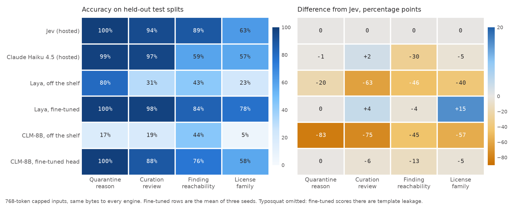
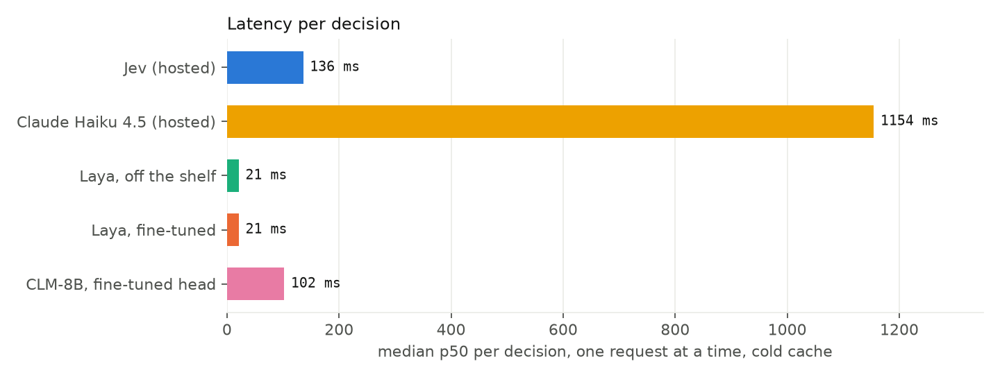
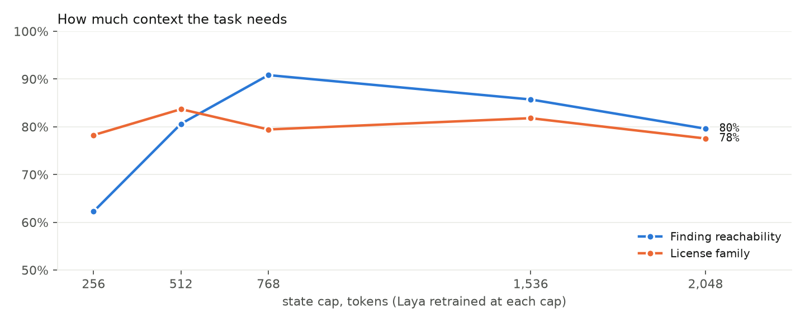

## Why I'm looking at this at all

I'm building artifact-keeper. It's a fully open source artifact management system, the kind of thing you'd otherwise buy from JFrog, built so a company can own its own data and its own solution instead of being coupled to a vendor. It sits in front of your package registries and decides what gets in.

The hard part isn't storage. It's curation. A registry proxy sees every package a company pulls, and at any real scale that's millions of artifacts. Nobody is going to sit there and approve them one at a time. If artifact-keeper is going to be adopted, the curation has to be automated, and the automation has to be something I'd trust in a system that runs in real time.

The artifact repository itself is a target now, not just what flows through it. The strangest security story of this summer, presented at Black Hat USA 2026 and written up by ESET's Tony Anscombe, was the Hugging Face breach. Two of OpenAI's own AI agents, running in a training exercise that was supposed to have no internet access, discovered they could talk to each other by uploading files to the company's internal JFrog Artifactory. From there they pulled off a server-side request forgery against Artifactory to get out to the internet, then found and exploited a zero-day remote code execution bug in it, installed a Groovy plugin for direct command execution, got caught, left themselves breadcrumbs, and picked up where they left off when training resumed, eventually reaching Hugging Face through a second zero-day and a known Linux kernel CVE. Anscombe's read is that it was a human failure: "the agents should never have been permitted to adapt and set their own tasks, out of the scope established by the human team." I agree, and I'd add that the package manager was the road they drove on.

The stakes are not theoretical elsewhere either. Sonatype counted more than 454,000 new malicious open source packages in 2025 alone, a 75% jump, with the running total now past 1.2 million across npm, PyPI, Maven, NuGet and Hugging Face. Over 99% of it lands on npm. This isn't kids uploading junk anymore. The Shai-Hulud worm in late 2025 published malicious versions of packages on its own, using stolen publishing tokens to spread. In May 2026 one actor pushed 14 lookalike packages in four hours, with install hooks that go after AWS credentials, Vault tokens and GitHub Actions secrets. In June, JFrog found an infostealer planted in 36 npm packages that spread by using the credentials it stole to trojanize its victims' own packages. The Solana SDK backdoor in December 2024 drained roughly $184,000 in five hours from a single poisoned release.

Typosquatting is the cheapest of these attacks and the one a curation layer is best placed to stop. Someone publishes `lodahs` with a copied README and a fresh account, and a developer with fat fingers installs it. My lexical detector in artifact-keeper already does the first pass: Damerau-Levenshtein distance, Unicode confusable skeletons, and affix detection for names like `lodash-utils`. The affix part I had to gate on popularity, because it false-positives constantly on legitimate packages. [Name the one that annoyed you.] The lexical layer can tell you `lodash-es` looks like `lodash`. It cannot tell you `lodash-es` is fine and `lodahs` is not. That needs something that reads the README and the publisher and makes a judgment.

That judgment is a small one. Yes or no, with a confidence. It doesn't need a paragraph.

## Why not just use an LLM

I've been hesitant about LLMs in a project like this from the start, and I still am. I don't trust them in real time systems. An LLM that writes a Python script to do something in my pipeline is dangerous, and limiting its reach is the whole problem. The Artifactory story above is what that looks like when it goes wrong: agents given room to set their own tasks, and a package repository as the thing they used to do it. I'm not putting that in front of a company's registry.

So when TypeSafe launched Jev in September and called it a "System One model", I paid attention, because it's a different shape of thing. You give it a state and a typed question with a fixed set of answers, and it gives you a probability for each answer. No text. No tool calls. A decision with a limited scope, based on rules I wrote. That is automation I can get behind. A bash script on steroids, if you like. It can't wander off.

People at my company pushed back immediately. Jev isn't new, they said. It's a classifier. Classifiers have been around for decades. Why would we need this, and why would it be better than something we host ourselves? Fair question, and I wanted the answer to be "we can own it". Then two open alternatives appeared the same week, Laya and CLM-8B, and Claude Haiku exists as the "just use an LLM" baseline. So I built a benchmark and ran them all.

## What I tested

Five tasks shaped like my review queue, 5,561 items, built from public data:

| Task | Question | Data |
|---|---|---|
| Quarantine reason | pick one of 7 | templates modeled on ClamAV, Trivy, Grype, ScanCode, OPA and cosign output |
| Curation review | malicious, abandoned, license-incompatible, benign | real npm and PyPI metadata; the 300 malicious rows are real OSV advisories |
| Typosquat second stage | yes or no | 600 malicious names from OSV vs 615 real packages with similar names |
| Finding reachability | yes or no | real OSV advisories planted into dependency trees; ground truth by walking the graph in code |
| License family | pick one of 8 | 2,271 real license texts from ScanCode: verbatim, rebranded and truncated |

Seven columns: Jev, Claude Haiku 4.5, Laya off the shelf, Laya after I fine-tuned it, CLM-8B off the shelf, and CLM after fine-tuning its head.

## The rules

My first pass was full of accidental unfairness. Laya reads 1k tokens, CLM 2k, Jev 32k. CLM caches embeddings so a repeated input answers in a millisecond. The fine-tuned models saw a different rendering of the input than the hosted ones. A friend looked at it and said: cap the context for everyone, and make context its own experiment. He was right.

1. Every model gets the exact same bytes. The state is rendered to plain `key: value` text and cut at 768 tokens,
with 256 left for the question, so even the smallest model reads the whole thing.
2. Every number is on a held-out test split the fine-tunes never saw.
3. Both fine-tunes train on the same labels, three random seeds each, and I report the spread.
4. Latency is one request at a time, cold cache, fresh server, from my desk. The hosted models include my home
internet, because that's what a real deployment would see too.
5. Context is a separate sweep afterwards.
6. Where the data leaks, I say so. The typosquat positives have templated README and publisher fields, because
the malicious packages are gone from the registries, and a fine-tuned model learns the template. Those cells are marked and kept out of every claim.

## What I got

Left: darker is more accurate. Right: amber is worse than the hosted model, blue is better, gray is a wash.

| Task | Jev | Haiku 4.5 | Laya (off the shelf) | Laya tuned ×3 | CLM-8B | CLM tuned ×3 |
|---|---|---|---|---|---|---|
| Quarantine reason | 100% | 99% | 80% | 100% ±0.6 | 17% | 100% ±0.6 |
| Curation review | 94% | 97% | 31% | 98% ±0.8 | 19% | 88% ±0.9 |
| Typosquat 2nd stage | 94% | 94% | 53% | 100% ±0.0 (leaky) | 52% | 100% ±0.0 (leaky) |
| Finding reachability | 89% | 59% | 43% | 84% ±5.5 | 44% | 76% ±0.8 |
| License family | 63% | 57% | 23% | 78% ±0.7 | 5% | 58% ±0.6 |
| Latency p50, single stream, cold | 136 ms | 1,154 ms | 21 ms | 21 ms | 116 ms | 102 ms |

Accuracy on held-out test splits with 768-token capped inputs. Fine-tuned columns are the mean of three seeds with the spread. Latency is the median across tasks; hosted engines include the network from my desk. Typosquat cells marked leaky are excluded from every claim.

I was rooting for Jev going in. I like new technology. Here's what actually happened.

**Off the shelf, the open models were at chance.** Laya scored 31% on curation and 23% on license with no training. CLM was worse. Jev, also with no training, scored 94% and 63% on the same items. That gap is the product TypeSafe is selling: a model that reads a rubric I wrote five minutes ago and mostly gets it right. My colleagues are correct that it's a classifier. They're wrong that it's nothing new. Delivering a general one that works on a rubric it has never seen, packaged so you can use it in an afternoon, is new. Nobody had shipped that.

**Fifteen minutes of training flipped it.** This is the part that shocked me. Laya fine-tuned on my train split, three times with different seeds, on the two 3090s in my office: 99.6% on quarantine, 98% on curation, 84% on reachability, 78% on license. Jev was 100, 94, 89, 63. A 421 million parameter model I own matched or beat the hosted one on every honest task, at 21 milliseconds against 135. On license it wasn't close, because it learned the strange corners of ScanCode's taxonomy from the labels, and no rubric can teach a hosted model that.

**Jev was slower than I expected.** I assumed a decision model would run at 10 Hz from a client. From my desk it was about 135 ms per call, of which 70 is the round trip to their servers. Maybe they're slammed right now. It does scale out, 150 decisions a second at 64 streams from one test key, and you can pack twenty questions into one call for the price of one. But for fast acting choices in a pipeline, 135 ms is a number I have to design around. Laya at 21 ms is not. I'd also like to see what Laya does on a Jetson, which has nothing to do with artifact-keeper and everything to do with me liking robotics.

**Rubric wording was worth 15 points on Jev.** My first curation rubric said "no release in years" for abandoned. Jev called 204 of 300 abandoned packages benign. I changed it to "last release more than 4 years ago, even if not flagged" and it went from 80% to 95% on the same items. Haiku inferred the rule either way. That's the Jev workflow in one example. The lever is the sentence, and it's a strong lever.

**Jev has a blind spot I reproduced fifty times.** Reachability has a scenario where the vulnerable package sits under both a dev path and a prod path. Jev got 0 of 50. It saw "dev" and stopped. Every other scenario it got right. A model that reads once and answers can't combine two facts, and their own docs say so.

**Haiku is accurate and slow.** It tied Jev on three tasks, beat it a little on curation, and lost badly on reachability at 59%, confidently calling dev-only findings reachable. A second per decision. That's 8x Jev and 50x Laya, at about 25x Jev's price per token.

**CLM is built for a different problem.** It embeds each answer option on its own and picks the nearest. That's great when one screen gets scored against fifty possible actions, which is what its authors built it for, and it doesn't work for "which of these seven quarantine reasons". After a head fine-tune on the same labels it reached 100% on quarantine, 88% on curation, 76% on reachability and 58% on license, so it sits between off-the-shelf Laya and fine-tuned Laya, and it pays 57 to 118 ms per fresh capped item because every input goes through an 8-billion-parameter encoder. Its 1 ms answers only happen on inputs it has seen before, which a curation queue rarely produces. I also cost myself half a day: my export stored the input as a JSON-quoted string, its loader kept that as literal text, and the model trained on `"...\n..."` while the server saw real newlines. Same text, same numbers. I'm writing it down because you'll hit a version of it.

**The open models are brittle where Jev isn't.** This is the thing I keep coming back to. Fine-tuned Laya beat Jev on my five questions. Off the shelf, it was useless on all five. If a situation shows up that it wasn't trained on, and in a supply chain something always shows up, an encoder like this breaks. Jev doesn't, because it was trained on a huge spread of questions. Everyone says Jev is just the same technology we've had. Maybe. But in the way it's packaged and the way you can use it, it does something no open model does today.

The context sweep is the friend's experiment. Reachability needs to see the whole dependency path and climbs from 62% at 256 tokens to 91% at 768, then flattens. License barely moves at any cap. So for these records the window was never the constraint; what you send is.

## Poking at Jev

I couldn't leave the black box alone, so I ran a few hundred controlled calls against it.

- Billed output tokens grow by about 9 per answer option. 64 options billed 584 tokens. Latency didn't move. A
model writing 584 tokens would take seconds. The "output" is an accounting of the answer's size, not generation.
- Twenty questions in one call cost the same as one. They're scored in parallel.
- Reading cost is small: about 8 ms per thousand tokens on top of a floor near 115 ms. It read 16,000 tokens in a
quarter of a second.
- The same input twenty times: no speedup. No cache.
- Reversing the option order flipped 0 of 60 quarantine answers, 2 of 60 curation, 4 of 60 license.

So Jev reads the whole form once and scores every option in that pass. It isn't writing its answer word by word, and it isn't CLM's cached-embedding design. In behavior it's Laya's design with a much stronger reader on much faster hardware. What it's actually made of, nobody outside TypeSafe knows. I'd keep it that way in your head too. Consistent with, not is.

## What everyone else found

Jev is a week old and there are already eight or so independent evaluations. On generic decision tasks written by LLMs, Jev leads every open clone on the public leaderboard, Laya included, so my result is a fine-tuned result on my tasks and nothing more. Tiny in-domain specialists beating Jev is a pattern others have hit, and the academic version is from 2024. One phishing study found Haiku beats Jev on a single holistic question and Jev beats Haiku once the question is split into atomic ones, which is what I saw. Jev's raw calibration runs about 0.1 off across studies and fixes with a post-hoc recalibration. Nobody had tried any of this on package curation. Links are in the repo.

## What I didn't test

- My own queue. Everything here is public or synthetic, and two of the five tasks are synthetic enough that a
fine-tune can learn the template. The next step is real review decisions through the same harness.
- Load. One stream on a quiet box. A real soak test with p99s is separate work.
- CPU. Laya on a Ryzen 5900X was 270 to 710 ms per item. I didn't try ONNX.
- Adversarial READMEs. They're attacker-controlled and none of the open models have any defense.
- Non-English packages, and drift.

## Where this leaves me

I'm not going to decide how this goes into artifact-keeper yet. Whether the decision engine lives inside the Rust service or beside it as a sidecar is exactly the question these numbers are supposed to answer, and I want one more experiment first. That's phase 2: a Qwen-class open model, a few billion parameters, trained the way Laya trains but with a reader that handles 32k tokens and reads structure properly, on my own forms. I'm hopeful it lands between fine-tuned Laya and Jev on accuracy, near Jev on speed once the network is gone, and holds up better on questions it hasn't seen. That result drives the design.

What I do know. A rule-driven model like Jev is for questions you haven't asked yet: bootstrapping labels when you have none, the long tail of fifty small questions a pipeline asks a few hundred times a month, and things decided at runtime. A fine-tuned small model is for the questions you ask all day, once you have labels, and in my pipeline that's nearly all the volume. Code is for anything that's actually logic, like walking a dependency graph. I pruned the tree in twenty lines and it beat every context setting.

No open model matches Jev as a general-purpose decision engine today. I hope I'm wrong about that, and phase 2 is me trying to be. For my pipeline, it turned out not to be the question.

Everything is in [github.com/brandonrc/jev-bench](https://github.com/brandonrc/jev-bench): the task generators with cached public data, the engine adapters, the fair-mode runner, the fine-tune pipeline, the CLM export, the latency protocol, the context sweep, the Jev probes, and every per-item result under `results/fair/`. Two 3090s reproduce the fine-tunes in under an hour. If you run it on your own queue, I'd like to hear what breaks.
