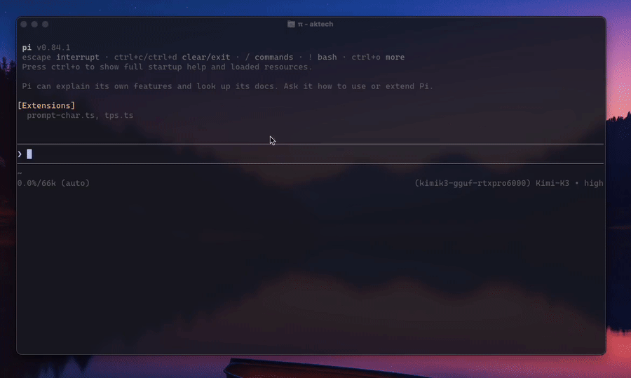
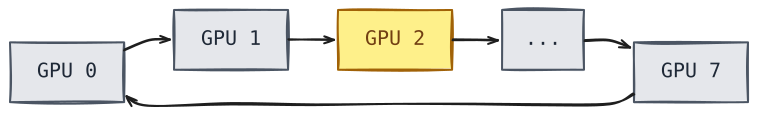

Kimi-K3 is a 2.8 trillion parameter mixture-of-experts model (104B active) from Moonshot AI. The full-precision checkpoint is 1.56 TB, too large for any single-node GPU cluster you could rent. In this exercise we explore if we can you run it on 8 workstation-tier GPUs?

We rented an 8x NVIDIA RTX PRO 6000 Blackwell Server Edition box, downloaded Unsloth's 2-bit GGUF quant, and spent a few hours measuring throughput, cost, and whether the quantization holds up on an extremely small subset of the reasoning benchmarks. We also tried to run it via vLLM, hit a structural dead end and ran the same benchmark suite on the hosted API (for Kimi-K3) for a sanity check. And yes, we ran the pelican test.

## The setup

| Component | Spec |
|---|---|
| GPUs | 8x RTX PRO 6000 Blackwell Server Edition, ~95.6 GiB VRAM each, ~765 GiB total |
| GPU interconnect | No NVLink, PCIe Gen5 x16 only |
| CPU | AMD EPYC 9555 (64-core), 240 vCPUs |
| RAM | 708 GiB |
| OS / driver / CUDA | Ubuntu 24.04.4, driver 580.126.09, CUDA 13.0 |
| Cost | $15.531/hr all-in |

**Model:** `unsloth/Kimi-K3-GGUF` (the `UD-IQ2_XXS` quant, 711.07 GB on disk exactly, ~2.06 bits per weight). It's the largest of Unsloth's six published tiers that fits entirely in this box's VRAM without spilling into system RAM. Sizes, accuracy and retention number's from [Unsloth's own published numbers](https://unsloth.ai/docs/models/kimi-k3).:

| Quant | Size | Combined RAM+VRAM needed | Accuracy (Unsloth's figures) |
|---|---|---|---|
| UD-IQ1_S | 594 GB | 610 GB | 78.9% |
| UD-IQ1_M | 649 GB | 665 GB | 81.2% |
| **UD-IQ2_XXS (ours)** | **711.1 GB** | **726 GB** | **84.1%** |
| UD-Q2_K_XL | 861.3 GB | 880 GB | 90.4% |
| UD-Q4_K_XL | 1,510 GB | ~1,530 GB | near-lossless |
| UD-Q8_K_XL | 1,560 GB | 1.6 TB | full precision |

**Software:** vanilla llama.cpp has no `kimi-k3` architecture support right now (there's an open, unmerged PR upstream). We built from `unslothai/llama.cpp`'s `kimi-k3-fullsize-vision` branch to run this model.

While running it we confirmed that the whole model is GPU-resident. Summed VRAM usage across all 8 GPUs came to 730.9 GB, more than the 711.07 GB model size, leaving headroom for the KV cache. Host RAM usage during actual serving was consistent at 33 GiB, in line with normal process overhead.

## Throughput: 14.6 tokens per second

Single-request decode speed held steady at **14.5-15.6 tok/s** across every run.

This is what that pace looks like on screen, captured at real speed.

For context: a naive memory-bandwidth roofline calculation (8x RTX PRO 6000's 1,597 GB/s bandwidth each, 104B active params at ~0.26 bytes/param for this quant) predicts a theoretical ceiling of about **470 tok/s**. We're running at roughly **1/32nd of that ceiling.**

The reason isn't the missing NVLink, at least not directly. It's the parallelism strategy. llama.cpp's default multi-GPU mode, `--split-mode layer`, is a pipeline: each GPU processes its assigned chunk of layers, then hands the intermediate result to the next GPU, one at a time.

We confirmed this directly: sampling `nvidia-smi` mid-request, only one of the eight GPUs ever showed non-zero utilization at any given instant. Power draw told the same story: total system draw was ~730W during generation, nowhere near the ~4,800W eight fully-loaded 600W cards would pull if they were all working simultaneously.

There's a second multi-GPU mode, `--split-mode row`, that *would* use all eight GPUs at once by splitting each layer's math across them. That mode needs fast GPU-to-GPU bandwidth for its per-layer all-reduce step, and RTX PRO 6000 Blackwell has no NVLink (NVIDIA dropped it from the workstation RTX 6000 line starting with the Ada generation; Blackwell's version doesn't bring it back). Whether that would have mattered is moot: `--split-mode row` failed to load outright, with `device CUDA0 does not support split buffers`. We traced this to [the exact line in llama.cpp's source](https://github.com/unslothai/llama.cpp/blob/768d2a481a99cb75ec9a03b95dadbd35e7acf496/src/llama-model.cpp#L986) and confirmed via `grep` that the required backend function, `ggml_backend_split_buffer_type`, doesn't exist in the CUDA backend of *either* the Kimi fork or vanilla upstream llama.cpp. Row-mode is currently broken for CUDA, full stop, independent of which GPU you throw at it.

### Prefill vs. decode scaling

| Prompt tokens | Prefill tok/s |
|---|---|
| 295 | 80.8 |
| 495 | 123.1 |
| 895 | 128.9 |
| 1,695 | 136.5 |
| 3,295 | 140.7 |
| 5,037 | 143.8 |

Prefill throughput climbs steeply with batch size and plateaus around 140-145 tok/s past a couple thousand tokens, because prefill parallelizes across the tokens in the prompt. Decode can't do that: it's one token at a time by definition, so it stays flat regardless of context depth, all the way up to the ~5k tokens we tested.

### Concurrency scaling

| Concurrent requests | Per-request tok/s | Aggregate tok/s |
|---|---|---|
| 1 | 14.6 | 14.6 |
| 2 | ~12.3 | ~24.7 |
| 4 (server's slot limit) | ~9.4 | **~37.5** |

Running 4 requests at once doesn't quarter your speed, it drops each one by about a third while total system throughput goes up 2.6x. If you're serving this model for real, running at concurrency 1 leaves real throughput on the table for free.

## What it costs

At $15.531/hr all-in and the measured throughput above:

| Workload | Cost per 1M tokens |
|---|---|
| Decode, 1 request | $295.50 |
| Decode, 2 concurrent | $174.66 |
| Decode, 4 concurrent | $115.05 |
| Prefill (plateau) | $30.17 (per 1M prompt tokens) |

Moonshot's own Kimi-K3 API charges **$3/1M input, $15/1M output** ($0.30/1M for cached input). Self-hosting this specific setup costs **7.7x to 19.7x more per output token** than just using the API. On pure economics, this doesn't win.

## Reasoning benchmarks

GSM8K alone doesn't answer this well since it's largely saturated for any model this size. We ran it anyway (10 questions, zero-shot, exact-match scoring against ground truth) and got **10/10**, a fine sanity check and a low bar.

**MMLU-Pro** is harder and spans more domains, so it's more informative. We sampled 10 questions spread across 10 different categories (business, law, psychology, chemistry, history, health, economics, math, physics, philosophy) from the 12,032-question test set, and got **8/10 correct**. Both misses were the model running out of a generous token budget while still reasoning, never converging on a final letter. Neither was a wrong answer, both were no answer.

We also ran a **needle-in-haystack** test: a made-up fact buried in a long, unrelated document, then asked to retrieve it. We built documents at three target sizes (8k, 16k, and 32k words), which tokenized out to 3,873, 7,603, and 15,063 actual tokens respectively, with the fact placed in the middle each time. At the 16k-word depth, we separately tested the fact placed at the very start vs. the very end of the document, to check for the "lost in the middle" effect some models show.

**5/5 correct across every depth and every position we tested.** No detectable position sensitivity at this scale.

This model does hidden chain-of-thought reasoning by default, and it can burn through a surprisingly large token budget doing it. Ask it a simple question with a 128-token cap and you may get an empty answer with `finish_reason: length` while the entire budget disappears into invisible reasoning. Size your `max_tokens` generously.

## Trying vLLM instead

llama.cpp works, but we wanted to know if vLLM could do better. We installed `vllm==0.26.0` and the separate `vllm-gguf-plugin==0.0.4` (GGUF support was moved out of vLLM core into this plugin) and pushed the load as far as it would go.

Five fixes got a fresh install to a loading model:

- A missing `config.json`, fixed by downloading it from the original safetensors repo
- The downloaded `config.json` declared `architectures: [KimiK3ForConditionalGeneration]`, but vLLM's registry only knows this model family as `KimiLinearForCausalLM`
- A missing build dependency for Triton (`python3.12-dev`)
- A version mismatch between the GGUF plugin and vLLM core
- Missing custom tokenizer files

With those fixed, vLLM resolved the architecture and spawned distributed workers across all 8 GPUs.

The real blocker came next, and it's structural, not a bug: `RuntimeError: Unknown gguf model_type: kimi_k3`. The plugin's GGUF weight loader translates GGUF tensor names into PyTorch parameter names by looking up the architecture in the `gguf` Python package's own registry, a separate dependency from vLLM itself. Kimi-K3 isn't registered there, and even if it were, the plugin's hand-written tensor-mapping code only covers a handful of known MoE architectures (`deepseek_v3`, `qwen2_moe`/`qwen3_moe`, `olmoe`, `minimax_m2`). Kimi-K3's delta-rule attention has no precedent in any of them.

Fixing this for real means hand-writing new tensor-mapping code, cross-referenced against llama.cpp's own implementation to get names and shapes right. We stopped here deliberately: a wrong mapping wouldn't necessarily fail loudly, it could silently produce garbage output from misaligned tensors, worse than a clean failure.

vLLM's native model implementation (`kimi_linear.py`) already threads a `quant_config` through its standard quantizable linear layers. Non-GGUF quantization formats (AWQ, GPTQ, FP8, compressed-tensors) go through vLLM's own loading path and never touch the GGUF plugin, so they likely avoid this wall entirely. We didn't test it.

## How it compares to a hosted deployment

We ran the identical GSM8K, MMLU-Pro, and needle-in-haystack suites against Kimi-K3 through OpenCode Go's hosted subscription, which serves the model at (presumably) full precision. This isn't Moonshot's own API. OpenCode Go is a third-party service, and we don't know whether it runs Moonshot's infrastructure directly or its own.

| Test | Self-hosted (2-bit) | OpenCode Go (hosted) |
|---|---|---|
| GSM8K (10 questions) | 10/10 | 8/10 (2 request timeouts, not wrong answers) |
| MMLU-Pro (10 questions) | 8/10 | 8/10 (1 empty output, 1 genuine wrong answer) |
| Needle-in-haystack (3 depths) | 3/3 | 3/3 |

Both land at roughly the same accuracy on this small sample, with different failure modes: our self-hosted box occasionally fails to converge on hard questions, the hosted service occasionally times out or returns nothing. Neither is more "correct" here, they're just different reliability characteristics at this sample size.

If you're running your own comparison this way, watch out: driving a hosted CLI tool through its normal `run` command may execute as a full agentic coding assistant with file read/write/shell access in your working directory, not a plain text-completion call. We learned this the hard way when a creative prompt caused it to read and then overwrite an existing file in our own project. Run this kind of test from a directory that isn't nested inside any git repository, and don't assume a CLI's default mode is a clean, isolated completion API.

## The pelican test

[Simon Willison's "SVG of a pelican riding a bicycle"](https://simonwillison.net/tags/pelican-riding-a-bicycle/) is a fun, informative test of spatial and compositional reasoning that has nothing to do with math or trivia recall.

Our self-hosted model needed **5 attempts** to produce a complete drawing. The first two attempts burned the entire token budget (3,000, then 8,000 tokens) on invisible reasoning and produced zero visible output. Looking at the reasoning trace, it wasn't stuck, it was doing detailed design work (working out exact hex colors, checking that a red scarf wouldn't blend into an orange beak) but never stopped planning long enough to write the actual SVG. Adding an explicit "keep your reasoning brief" instruction got real progress on attempts 3 and 4. Attempt 5, with an 8,000 token budget, finally finished naturally. Here's what it drew.

For comparison, the same model through OpenCode's hosted service produced this. Our first run there got contaminated (the CLI tool read and overwrote a file in our own project, the same agentic-tool-access issue noted above) and had to be discarded. This is the clean rerun, one attempt, in an isolated directory.

Both are recognizably pelicans on bicycles, with correct wheel geometry, drivetrains, and the pelican's wing reaching for the handlebars. Different compositions and color choices, exactly what you'd expect from two independent generations, not evidence that either is "better."

## Is it worth it?

For cost-efficient production serving, the API wins outright. 14.6 tok/s single-stream is slow for interactive use, and even the best-case 4-way-concurrent economics is still 7.7x worse than just paying Moonshot. The core bottleneck, pipeline-mode execution using one GPU at a time, is baked into the only working software path today: the alternative mode is broken in llama.cpp's CUDA backend for everyone, on any hardware.

But this is the only path in our testing that produced a working, generating model at this parameter count on hardware you can reasonably buy or rent by the hour. An earlier, separate attempt to run this same model at full precision through vLLM on an 8x H100 box OOM'd without producing a single token. This setup succeeds where that one failed, but not by loading the same thing: it's the 2-bit quantized checkpoint, 711GB against the full precision version's 1.56TB, running at a fraction of that cluster's cost on GPUs with no NVLink and no datacenter pedigree. The quantization holds up well: 8-10 out of 10 on real reasoning benchmarks, coherent long-context retrieval at every depth and position we tried, and usable output on both a writing sample and the pelican test.

If your reason for self-hosting is data control, no third-party rate limits, or independence from a provider's pricing and uptime, none of which show up in a dollars-per-token table, this is a real, working way to do it.
