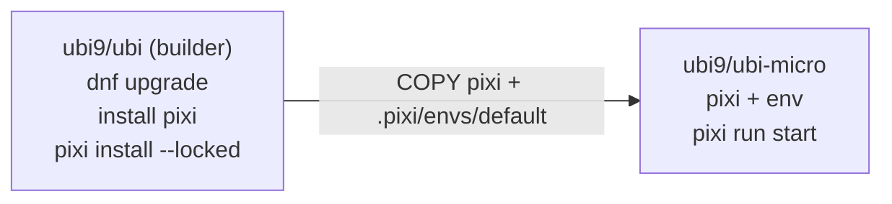

[pixi](https://pixi.sh) has become our default way to lock and reproduce
conda-forge environments, and sooner or later every pixi project ends up in a
container. The most common starting point is to grab a Red Hat
[Universal Base Image](https://catalog.redhat.com/software/base-images), install
pixi, run `pixi install`, and ship it. It works. But the resulting image is big,
and it carries the entire base-OS attack surface into production: a package
manager, a debugger, and nearly 200 RPMs you will never run.

Why UBI at all? If you are starting fresh, a distroless or `python:slim` base can
get smaller still. But plenty of teams are on UBI deliberately (Red Hat support,
FIPS, lifecycle and compliance guarantees) and are not free to walk away from it.
We take UBI as a given here and ask how lean it can get.

The build below produces the **same** pixi environment three ways (on `ubi9/ubi`,
`ubi9/ubi-minimal`, and `ubi9/ubi-micro`) and scans each with
[Trivy](https://github.com/aquasecurity/trivy) and
[Grype](https://github.com/anchore/grype). The pixi environment is held constant
on purpose, so the base image and how it is patched are the only variables, and
the difference in size and findings is the OS underneath.

All of the Dockerfiles, the demo project, the raw Trivy/Grype output, and a
GitHub Actions workflow that rebuilds and rescans every variant are in
[**github.com/brandonrc/pixi-ubi-micro**](https://github.com/brandonrc/pixi-ubi-micro).

## The project

A small but realistic workload: Python 3.12 with numpy, pandas, and scipy,
locked with pixi.

```toml
# pixi.toml
[workspace]
name = "pixi-ubi-micro"
channels = ["conda-forge"]
platforms = ["linux-64", "linux-aarch64", "osx-arm64"]

[tasks]
start = "python main.py"

[dependencies]
python = "3.12.*"
numpy = "*"
pandas = "*"
scipy = "*"
```

The committed `pixi.lock` makes the conda layer reproducible. Each image is built
with `pixi install --locked`.

## The "before": a single-stage full UBI image

This is what most teams ship first. One stage, on the full base, with a tidy
`dnf upgrade` to pick up the latest security errata:

```dockerfile
#| highlight: 4
FROM registry.access.redhat.com/ubi9/ubi:latest

# Apply the latest security errata to the base OS packages.
RUN dnf -y upgrade && dnf clean all && rm -rf /var/cache/dnf

# Install a pinned pixi (the installer reads PIXI_VERSION from the env).
ENV PIXI_VERSION=0.70.1
RUN curl -fsSL https://pixi.sh/install.sh | bash
ENV PATH="/root/.pixi/bin:${PATH}"

WORKDIR /app
COPY pixi.toml pixi.lock ./
COPY main.py ./
RUN pixi install --locked

# Run through pixi, just like you would locally.
ENV PATH="/app/.pixi/envs/default/bin:${PATH}"
ENTRYPOINT ["pixi", "run", "--locked", "start"]
```

The `dnf upgrade` is good hygiene. But look at everything else that comes along
for the ride: **dnf, curl, a debugger, and nearly 200 base-OS RPMs all remain in
the final image**. We want pixi in there; it is a pixi container, after all, and
we run the app with `pixi run`. What we do *not* need at runtime is the operating
system's package manager and the rest of the full userland.

So the question is: how little OS can we get away with while keeping pixi and the
environment intact?

## The insight: pixi and the environment are both relocatable

A conda-forge environment bundles its own Python interpreter, OpenSSL,
libstdc++, libgfortran, OpenBLAS. Everything it links against lives inside
`.pixi/envs/default`. The only shared library it needs from the host is
**glibc**. pixi itself is just as portable: a single glibc-linked binary. Neither
needs the OS package manager, a compiler, or most of a Linux userland.

So we do all the package-manager work on the full base, then copy *pixi and the
environment*, and nothing else, onto a near-empty base.



`ubi9/ubi-micro` is the smallest UBI. It has **no package manager** (you cannot
`dnf install` inside it), but it does ship glibc, bash, and coreutils, which is
plenty to host the pixi binary and a self-contained environment.

## The "after": multi-stage build into ubi-micro

```dockerfile
#| highlight: 19-21
# ---- builder: the full UBI base does the heavy lifting ----
FROM registry.access.redhat.com/ubi9/ubi:latest AS builder

# No dnf upgrade: nothing from the builder's OS reaches the runtime (see below).
ENV PIXI_VERSION=0.70.1
RUN curl -fsSL https://pixi.sh/install.sh | bash
ENV PATH="/root/.pixi/bin:${PATH}"

WORKDIR /app
COPY pixi.toml pixi.lock ./
COPY main.py ./
RUN pixi install --locked

# ---- runtime: ubi9-micro receives pixi + the workspace ----
FROM registry.access.redhat.com/ubi9/ubi-micro:latest
WORKDIR /app

# pixi is a single glibc-linked binary; copy it in (ubi-micro can't install it).
COPY --from=builder /root/.pixi/bin/pixi /usr/local/bin/pixi
COPY --from=builder /app/pixi.toml /app/pixi.lock /app/main.py /app/
COPY --from=builder /app/.pixi/envs/default /app/.pixi/envs/default

ENV PATH="/app/.pixi/envs/default/bin:${PATH}"
ENTRYPOINT ["pixi", "run", "--locked", "start"]
```

The builder differs from the full image in one deliberate way: there is no
`dnf upgrade`. Nothing from the builder's OS is copied into the runtime, so
upgrading it would patch nothing in the final image. The runtime stage starts
from `ubi-micro` and receives just three things: the pixi binary, the workspace
files, and the solved environment. dnf, curl, and the rest of the full base OS
stay behind in the builder, but pixi comes along, so `pixi run` works exactly as
it does on your laptop.

`pixi run` prints its task banner and then runs the workload, even with
`--network none`, because the lockfile and the copied environment already match,
so there is nothing to re-solve:

```bash
#| command-line
#| data-filter-output: (out)
docker run --rm pixi-ubi:micro
(out)Pixi task (start): python main.py
(out)pixi-ubi-micro demo
(out)  python  : 3.12.13 (aarch64)
(out)  numpy   : 2.4.6
(out)  pandas  : 3.0.3
(out)  mean    : 9.9795
(out)  std     : 2.0127
(out)  normaltest p-value: 0.5496
```

## The scan results

Built `linux/arm64` with pixi 0.70.1, scanned with Trivy 0.69 and a current Grype
DB. Across all three images the environment is identical (**41 packages**: 36
conda + 5 Python), and all three carry the same pixi binary. The only thing that
changes is the base OS. (minimal also gains `tar` and `gzip`, which the pixi
installer needs, so its package count is "minimal plus two.")

These numbers are a point-in-time snapshot. The repo's CI runs the same build on
`linux/amd64`; expect the same shape of result, but exact counts shift with
architecture and with the date you scan, since vulnerability databases change
daily. The deltas between bases are the durable part, not the absolute numbers.

**Image size and package count:**

| Variant | Uncompressed size | OS (RPM) packages |
|---------|------------------:|------------------:|
| full    | 803 MB | 188 |
| minimal | 666 MB | 112 |
| micro   | **511 MB** | **22** |

Most of micro's 511 MB is the environment: roughly 401 MB of conda packages plus
the ~65 MB pixi binary, identical on every image. Only about 45 MB is the micro
OS, against roughly 337 MB on full. So the base swap saves a fixed ~290 MB of
operating system. That is about a third of the image here, but the fraction
shrinks the heavier your environment is: a multi-gigabyte CUDA stack would see
the same ~290 MB saving as a rounding error.

**Trivy** (`--scanners vuln`):

| Variant | Critical | High | Medium | Low | Total |
|---------|:--------:|:----:|:------:|:---:|:-----:|
| full    | 0 | 1 | 129 | 226 | **356** |
| minimal | 0 | 0 | 67  | 57  | **124** |
| micro   | 0 | 0 | 10  | 6   | **16**  |

**Grype** (includes a Negligible tier Trivy does not have):

| Variant | Critical | High | Medium | Low | Negligible | Total |
|---------|:--------:|:----:|:------:|:---:|:----------:|:-----:|
| full    | 2 | 3 | 135 | 226 | 2 | **368** |
| minimal | 2 | 2 | 76  | 58  | 1 | **139** |
| micro   | 2 | 2 | 21  | 8   | 1 | **34**  |

Moving from the full base to micro takes the OS from 188 RPMs to 22. The image
drops from 803 to 511 MB, and the scanners report far fewer findings: Trivy
356 → 16, Grype 368 → 34. The counts are dramatic, but they are the least
interesting part of the story, and reading them as "95% fewer bugs" would be a
mistake. Several things matter more than the totals.

**The real win is attack surface, not the count.** A micro runtime has no package
manager, no debugger, and almost no userland, so an attacker who lands in the
container has far less to pivot through. The findings that disappear are
overwhelmingly low-severity, no-fix OS advisories; the ones that actually rank
Critical or High do not disappear (more below). Treat the smaller image as a
smaller blast radius, not as a lower bug count.

**Every Trivy finding is an OS package, and the environment is only partly
visible.** Trivy enumerates the 41 conda and Python packages and reports zero
matches against them, so the 356 → 16 drop is entirely the shrinking base. But
"zero" there means "no known advisory," not "audited": conda-forge coverage in
vulnerability databases is thin, and Grype does not catalog the conda packages at
all (it only flags the bundled CPython). The environment is a real, separate
surface these tools see only partially. The one Trivy HIGH on the full base is a
good example of why you read where a finding lives rather than the count:
`gdb-gdbserver` (CVE-2026-6846, no fix). The underlying flaw is a heap overflow in
binutils' libbfd, hit when linking a malformed XCOFF object and requiring user
interaction; it rides along on gdb only because gdb bundles libbfd. Red Hat's own
security data marks `gdb` *unaffected* on RHEL 9 (only `mingw-binutils` is flagged),
so this is most likely a no-fix scanner finding that Red Hat itself disputes, on a
debugger that has no business in production anyway. Either way it is gone the moment
you move to micro. Micro's remaining 16
are all no-fix advisories in glibc and friends (see "Patching the micro base"), so
they are the floor for this base, not a backlog you can burn down.

**The high-severity findings live in the interpreter and survive the move to
micro.** Grype attributes 2 Critical and 2 High to the CPython binary itself
(`python 3.12.13`); because the environment is identical, those four appear on
every image, micro included. The full base adds one more High, in `expat` (an OS
RPM), which is why the full row shows three Highs and the smaller bases show two;
that one goes away with the base. So shrinking the base clears OS findings like
that `expat` High, but it cannot touch the interpreter's own Critical and High
findings. You clear those by updating the environment (bumping Python in
`pixi.toml` and re-locking), not by changing the base. This is also why the two
scanners disagree on totals: they read different databases and detect the bundled
interpreter differently, which is the whole reason to run both.

**The pixi binary we kept adds no findings.** Neither scanner flags the ~65 MB
pixi executable, so shipping a real pixi container (one where `pixi run` works
inside the image) costs disk but not CVEs. You do not have to choose between a
usable pixi image and a small attack surface.

The practical takeaway: **run both scanners, and know where a finding lives.**
Base-OS findings are addressed by choosing a smaller base and keeping it current
(a fresh tag for micro, `dnf upgrade` for full and minimal). Environment findings
are addressed in `pixi.toml` and `pixi.lock`. They are two different jobs, and a
single total hides which one you actually have.

## Patching the micro base

If `dnf upgrade` does not run on the micro image, how does its OS get security
fixes? Not from the inside: `ubi-micro` has no package manager, and the builder's
upgrade never reaches it. The simplest answer is to patch it from the outside by
pulling a fresh `ubi-micro` (Red Hat rebuilds it with current errata) and pinning
to a digest you refresh on a schedule. With micro you are not maintaining an OS,
you are inheriting Red Hat's minimal one.

If you want to drive the patching yourself, you can. `dnf` running in the builder
can manage a root that has no dnf of its own, via `--installroot`. Copy the micro
rootfs into a full-UBI stage, upgrade it in place, and copy the result out:

```dockerfile
FROM registry.access.redhat.com/ubi9/ubi-micro:latest AS microfs

FROM registry.access.redhat.com/ubi9/ubi:latest AS patcher
COPY --from=microfs / /mnt/root
RUN dnf -y --installroot=/mnt/root --releasever 9 upgrade
# ... then COPY --from=patcher /mnt/root / into a fresh stage
```

This is essentially how Red Hat assembles ubi-micro in the first place (it
populates an empty root with `dnf --installroot` rather than upgrading a copy, but
the mechanism is the same). Against a current `ubi-micro` it reports `Nothing to
do`: the base is already up to date, and the 16 advisories Trivy flags (in glibc,
libgcc, pcre2, ncurses, and coreutils) are all no-fix, so there is no patched
package to move to.

Where it earns its keep is the enterprise reality of being behind the curve.
Qualifying a base image can take weeks, so a running service is often pinned to a
ubi-micro that is months old while a fresher one works through review. There you
do not have to ship the backlog. Point the same `--installroot upgrade` at the
pinned base and you apply the available errata in place, without changing the tag
you already qualified. On `ubi-micro:9.2`, for instance, Trivy reports 67 CVEs (7
of them HIGH); after the upgrade it is 16 with no HIGHs, the same floor as
`:latest`. Both scans are checked into
[`.scan-results/`](https://github.com/brandonrc/pixi-ubi-micro/tree/main/.scan-results),
and a runnable version (it takes the micro base as a build arg) is
[`Dockerfile.micro-patched`](https://github.com/brandonrc/pixi-ubi-micro/blob/main/Dockerfile.micro-patched).
The other time to reach for it is when you need to `install` an OS library micro
does not ship.

There is also `ubi9/ubi-minimal` as a middle ground: it keeps a slimmed-down
package manager (`microdnf`) and a shell, which is handy when you genuinely need
to install or debug something in the running container. The
[`Dockerfile.minimal`](https://github.com/brandonrc/pixi-ubi-micro/blob/main/Dockerfile.minimal)
in the repo follows the same shape.

## A note on STIG-hardened bases

Red Hat also publishes `ubi9/ubi-stig`, "UBI with selected STIG hardening for
containerized applications." If a compliance requirement brought you here, it is
worth being clear that STIG is a different axis from everything above: it is about
configuration hardening and FIPS, not about shrinking the image. The hardened base
is the full base plus extra packages (FIPS crypto providers, `crypto-policies`,
`audit-libs`, PAM and security config), so building the same pixi environment on
it gives you a *larger* image with *more* findings, not fewer. It weighs 838 MB,
and the scanners report 379 (Trivy) and 391 (Grype), including 4 Trivy HIGH and
7 Grype High, against 1 and 3 on plain full. That is expected: hardening adds
surface, it does not remove it.

There is a sharper catch for pixi specifically, and it is worth stating precisely.
FIPS is not a property of an image; it is enforced when the host runs in FIPS mode
and the container inherits the system crypto policy. Even granting that, a
conda-forge environment slips out from under it: the environment's `python` links
its own bundled OpenSSL (3.6.2 here), not the system's FIPS-validated provider,
and it does not consult the system crypto policy. The same self-containment that
lets the environment run on micro is what puts its crypto outside the host's FIPS
posture, hardened base or not. If you need FIPS-validated crypto end to end, a
STIG base image does not get you there on its own; you have to source FIPS-capable
builds of the libraries your environment actually loads. The
[`Dockerfile.stig`](https://github.com/brandonrc/pixi-ubi-micro/blob/main/Dockerfile.stig)
in the repo builds the variant if you want to scan it yourself.

## Building your own app on top

These images are meant to be reused as a base, and there are two cases worth
separating.

**Adding your own code.** If you only need to drop in a script or your own
package, a plain `COPY` works on any of the three bases, including micro
([`examples/Dockerfile.app`](https://github.com/brandonrc/pixi-ubi-micro/blob/main/examples/Dockerfile.app)):

```dockerfile
ARG BASE=pixi-ubi:micro
FROM ${BASE}
WORKDIR /app
COPY examples/extra.py /app/extra.py
ENTRYPOINT ["python", "/app/extra.py"]
```

It works everywhere because it only copies files in, and the inherited
environment is already on `PATH`. (These examples assume you have already built
and tagged the base locally, for example `pixi-ubi:micro`.)

**Adding a dependency.** This is where it is tempting to do the wrong thing. Do
not `RUN pixi install` on the micro image: micro carries pixi, so it would
technically work, but you would re-bloat the runtime with the solver's caches,
and the result would no longer match a committed lockfile. Instead, add the
dependency the same builder-to-micro way the base itself is built. Solve it on the
full base, then copy the updated environment into micro
([`examples/Dockerfile.app-multistage`](https://github.com/brandonrc/pixi-ubi-micro/blob/main/examples/Dockerfile.app-multistage)):

```dockerfile
ARG BUILDER=pixi-ubi:full

# Add the dependency on the full base (it has the solver and network).
# pixi add re-solves; pin a version and commit the lock for full reproducibility.
FROM ${BUILDER} AS build
WORKDIR /app
RUN pixi add rich
COPY examples/richdemo.py /app/richdemo.py

# Ship the updated environment on ubi-micro. The entrypoint calls the env's
# python directly, so this image does not need the pixi binary at all.
FROM registry.access.redhat.com/ubi9/ubi-micro:latest
WORKDIR /app
COPY --from=build /app/pixi.toml /app/pixi.lock /app/richdemo.py /app/
COPY --from=build /app/.pixi/envs/default /app/.pixi/envs/default
ENV PATH="/app/.pixi/envs/default/bin:${PATH}"
ENTRYPOINT ["python", "/app/richdemo.py"]
```

That image comes out at 453 MB: the micro runtime plus `rich`, smaller still than
the base micro image because it drops the pixi binary it does not use at runtime,
and it runs offline because the environment is already solved. When you own the
base image, the cleaner option is to add the dependency to `pixi.toml` and rebuild
the base; reach for this multi-stage app form when the dependency belongs to one
downstream app rather than the shared base. Either way, the rule holds: **solve
dependencies on the full base, run them on micro.**

## Recommendation

- **Ship to `ubi-micro` via a multi-stage build.** Run `pixi install` on the full
  base in a builder stage (no `dnf upgrade` there, since that OS is discarded),
  then `COPY` the pixi binary and `.pixi/envs/default` into `ubi-micro`. You keep
  a working `pixi run` image while getting a ~290 MB smaller footprint and more
  than an order of magnitude fewer OS findings (Trivy 356 → 16).
- **Reach for `ubi-minimal`** only when you genuinely need a package manager or
  shell in the running container.
- **Treat the environment as a separate security surface.** A small base does not
  fix vulnerabilities in your Python or conda packages, and the scanners see those
  packages only partially. Keep the lockfile current and scan it on its own terms.

A few things this post deliberately leaves out, each of which matters for a real
production image:

- **Non-root.** Every image here runs as root. For production, add a non-root
  user. On micro there is no `useradd`, so create the user in the builder, copy
  `/etc/passwd` and `/etc/group` over, and `chown` the app and environment to a
  numeric UID (for example `USER 1001`, which also suits OpenShift's random-UID
  model).
- **Signal handling.** `pixi run` becomes PID 1 and does not exec-replace or reap
  children, so `docker stop` can hang. Run with `--init` (or `tini`), or invoke
  the environment's `python` directly as the examples do; the latter also lets you
  run with a `--read-only` root filesystem.
- **Supply chain.** The build fetches the pixi installer with `curl | bash` (the
  script itself is unpinned) and uses `:latest` base tags. A real pipeline should
  verify the pixi download against a checksum, pin every base to a digest, and add
  image signing and an SBOM. The committed `pixi.lock`, with per-package hashes, is
  the one piece already locked down.
- **Scan scope.** We ran vulnerability scanning only. A production gate should also
  run misconfiguration scanning (which would flag the root user and `:latest`
  pins), secret scanning, and prioritize by exploitability (EPSS/KEV/VEX) rather
  than raw counts.

None of those change the shape of the result: do the package-manager work on the
full base, ship pixi and the solved environment on `ubi-micro`, and scan what you
actually ship.
