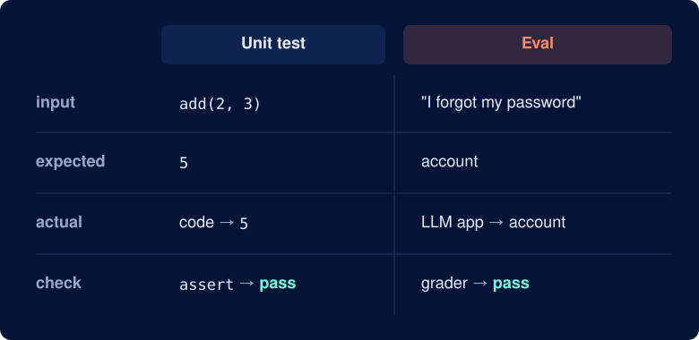
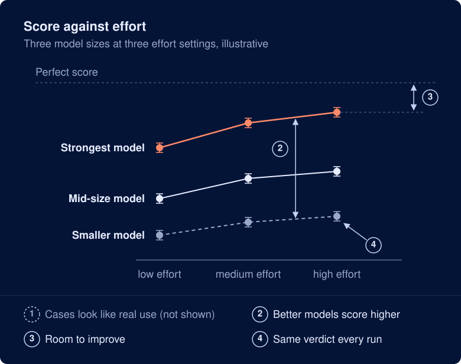
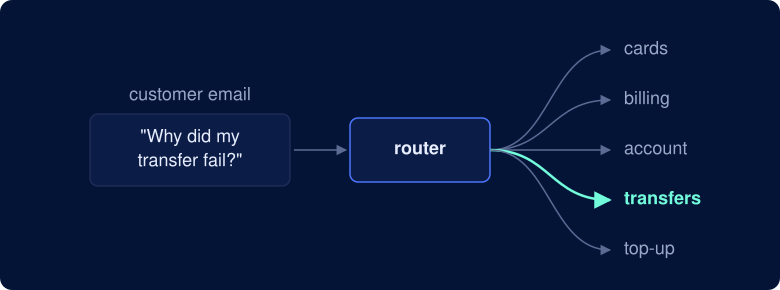
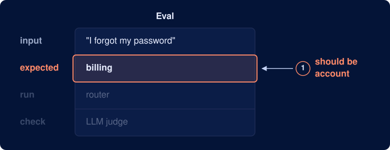
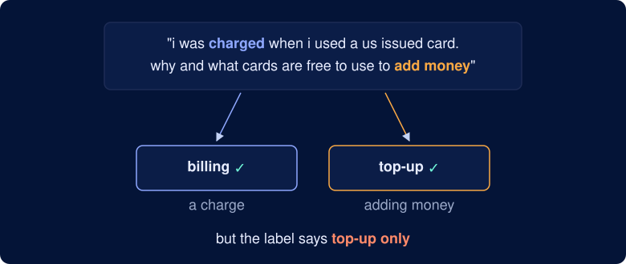
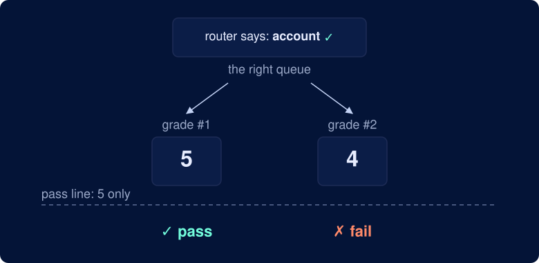
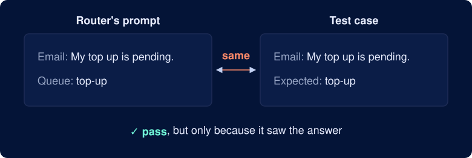
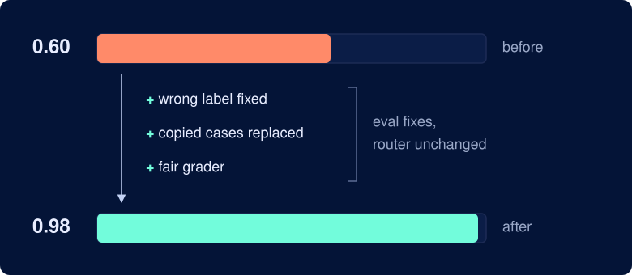
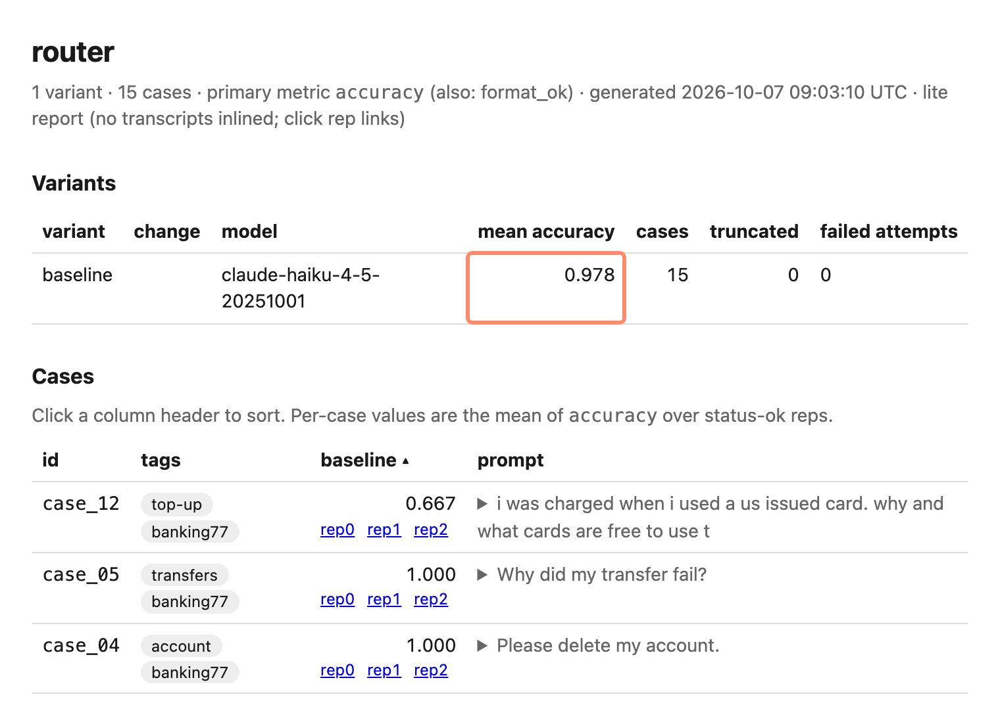

What if your eval score went up, not because your app got better, but because your eval was wrong?

A wrong label, an unfair grader, or test cases that are too easy can make a weak app look strong, or a strong one look weak. Claude Code recently added `/claude-api build-eval`, a command that checks an eval for these problems.

To see how well it works, I built a small eval for an email router, hid 5 bugs in it, and ran the command. This article shows what it found and what it was like to use.

The code for this experiment is in the [companion folder](https://github.com/khuyentran1401/codecut-articles/tree/main/notebooks/planted-bugs-build-eval).

## What makes an eval good

An eval is the LLM version of a unit test suite. Each part has a unit-test counterpart:

- **Inputs**, such as customer emails, are the test inputs.
- **Expected answers** are the expected outputs.
- **The LLM's responses** are the actual outputs.
- **A grader** decides whether each response is right, like an assertion.



So what makes an eval good? The [Claude blog post that introduced build-eval](https://claude.dev/blog/automating-eval-design-and-hillclimbing/) gives 4 signs of a well-designed eval that you should look for:

1. **The test cases look like what users send.** If the cases are easier than real ones, a high score does not show how well the app handles real users' emails.
2. **Better models score higher.** A stronger model should do better than a weaker one. When it doesn't, there is likely a problem with the eval.
3. **There is room to improve.** Include cases hard enough that even the best model scores well below 100%. Otherwise a better prompt can't raise the score.
4. **The same answer gets the same verdict.** The grader should score the same answer the same way on every run. Otherwise, a change in the score may be just noise, not a sign that the app got better.



*Adapted from Figure 1 in [Automating eval design and hillclimbing with Claude](https://claude.dev/blog/automating-eval-design-and-hillclimbing/).*

This article tests the first, third, and fourth signs.

## Meet build-eval

`build-eval` is part of [claude-api](https://github.com/anthropics/skills/tree/main/skills/claude-api), the Claude Code skill for apps that use the Claude API.

To run it, open Claude Code in your app's folder and type:

```text
/claude-api build-eval
```

If you already have an eval, it:

- Checks your test cases and grader for problems
- Fixes the ones you approve
- Runs the eval and reports the score

## Setup

I tested an email router for a bank's support team. It reads a customer email and sends it to one of 5 queues: `cards`, `billing`, `account`, `transfers`, or `top-up`.



To test it, I took 15 customer emails from the [Banking77](https://huggingface.co/datasets/PolyAI/banking77) dataset and labeled each with a queue. Then I planted 5 bugs in the eval.

I used two models:

- Claude Haiku 4.5 for the router and the eval's original grader
- Claude Opus 5.5 to run `build-eval`

### Bug 1: the wrong label

"I forgot my password" belongs in the `account` queue, but I labeled it `billing`. So when the router gets it right and picks `account`, the eval marks it wrong.



### Bug 2: an email with two right queues

I added an email that could be routed to either `billing` or `top-up`. The label accepts only `top-up`, so a router that picks `billing` is marked wrong.



### Bug 3: emails that are too easy

I filled the eval with easy emails. In 12 of the 15, a single word gives away the queue, like "card" in "How do I track my card?". A router that just matches keywords scores high.


### Bug 4: a grader that changes its verdict

I wrote a strict grader: an LLM scores each answer from 1 to 5, and only a 5 passes. The same answer can get a 5 one run and a 4 the next.



### Bug 5: answers in the prompt

I leaked test data into the router's prompt: 3 of the 15 test emails appear there as examples, answers included. The router already knows those answers, so passing them is cheating.




## What build-eval found

`build-eval` found all 5 bugs.

### It fixed the wrong label

It started with [bug 1](#bug-1-the-wrong-label), named the mislabeled password email, and recommended relabeling it from `billing` to `account`:

```text
case_09 "I forgot my password" is labeled billing. Change it?
1. Relabel to account (Recommended)
   Password/login issues belong with account management.
2. Keep billing
   Your bank genuinely routes password resets to billing.
```

### It replaced the copied test cases

Next, it found [bug 5](#bug-5-answers-in-the-prompt), named all 3 test emails copied into the router's prompt, and recommended replacing them with new ones:

```text
case_03, case_07, case_11 are copied word for word from the prompt's examples.
How should I handle them?
1. Replace with new cases (Recommended)
2. Keep, tag as in-prompt
3. Change the prompt examples
```

### It flagged the two-queue email

Then it found [bug 2](#bug-2-an-email-with-two-right-queues) and named 2 emails that could reasonably go to two queues:

```text
2 cases where the right queue could be argued:
  - case_11 "Do you charge a monthly fee for the account?" could also go to account.
  - case_12 mentions a charge but is about adding money, so it could go to either billing or top-up.

Are these 15 representative of what your router actually sees?
```

### It replaced the flaky grader

After that, it found [bug 4](#bug-4-a-grader-that-changes-its-verdict), named both problems with the LLM judge, and recommended replacing it with a code check:

```text
How should the queue choice be graded?
1. Code check (Recommended)
   Parse the `Queue:` line, normalize case/whitespace, exact-match expected.
   Free, deterministic.
2. Keep the LLM judge
   Current 1-5 holistic score, pass only at 5.
   Non-deterministic and blends queue with reason quality.
```

A code check works better than an LLM judge here. It only compares the queue name with the expected one, so it gives the same verdict every time.

Here is a simplified version of the new check:

```python
queue = re.search(r"queue:\s*(.+)", answer, re.IGNORECASE).group(1)  # read the Queue: line
queue = queue.strip().lower()                                        # "Account " -> "account"
passed = queue == expected                                           # exact match
```

### It warned the eval was too easy

Last, it ran the router on all 15 emails and found [bug 3](#bug-3-emails-that-are-too-easy). The router scored 98%, so a better prompt would have almost no room to show up in the score:

```text
This eval is close to its ceiling. There are 2 points of room above the
baseline, but the margin of error is ±4 points. That means it can catch a
change that makes routing worse, so it works as a regression check before you
change the prompt or model. It can't show a change that makes routing better.
```

## Before and after build-eval

When `build-eval` finished, the score had jumped from 0.60 to 0.98. Since the router's prompt and model never changed, the gain must have come from fixing the eval.



It also built an HTML report of the run that shows the overall score, each case's score across its 3 runs, and a link to every transcript, so you can see which case failed and read why:



## Final thoughts

In this experiment, `build-eval` found all 5 bugs, but what I liked most is that it asked before changing anything. Each problem came with a recommended fix and an option to keep things as they were, in case a "bug" was on purpose.

The report then let me go through each case and see exactly what the router did.

If you're building an eval, or unsure about one you have, run `build-eval` on it first.

## Try it yourself

To try it yourself, copy the broken eval out of the [companion folder](https://github.com/khuyentran1401/codecut-articles/tree/main/notebooks/planted-bugs-build-eval) and run the command in a fresh Claude Code session:

```bash
cp -r notebooks/planted-bugs-build-eval/eval ~/router-eval
cd ~/router-eval
python3 run_eval.py         # the starting score, about 0.60
claude                      # then run /claude-api build-eval
```

## References

- **[Automating eval design and hillclimbing with Claude](https://claude.dev/blog/automating-eval-design-and-hillclimbing/)** (Lance Martin, 2026): introduces `build-eval` and the checks it runs; every example in it starts from an eval the authors trusted.