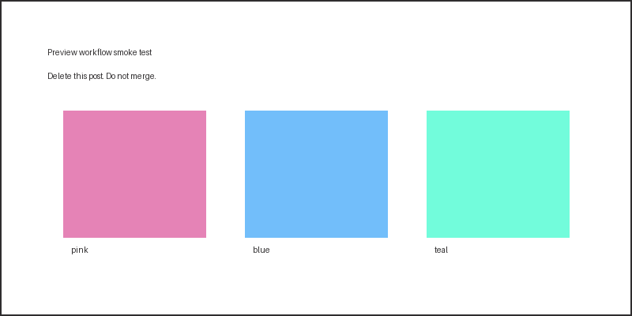
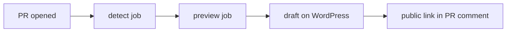

This post exists to exercise the draft preview workflow added in #52. It is not an article. The PR that carries it will be closed, not merged.

## What it checks

Each element below travels a different path through the publish pipeline, so a rendering failure points at a specific stage.

## Image upload

The image is a PNG, since ModSecurity blocks SVG uploads to the REST API. If it renders, `upload_and_replace_article_images` rewrote the relative path to a WordPress URL.



## Code block

```python
def preview(post: str) -> str:
    """Return the public preview URL for a draft."""
    return f"https://openteams.com/?p={post}&preview=true"
```

## Line highlighting

```python
#| highlight: 2-3
import pandas as pd

df = pd.read_csv("data.csv")
result = df.groupby("category").sum()
```

## Command line

```bash
#| command-line
#| data-filter-output: (out)
uv run scripts/wordpress/preview_draft.py posts/example.md
(out)✅ Draft preview (public): https://openteams.com/?p=1&preview=1&_ppp=abc
```

## Mermaid



## Table

| Stage | What it proves |
| --- | --- |
| Comment appears | The workflow ran and the sticky-comment action posted |
| Link opens signed out | The public preview route minted a working nonce |
| Image renders | The upload and path rewrite both worked |
| Draft disappears on close | The cleanup job ran |

## Blockquote and inline formatting

> A preview is only useful if it fails the same way production does.

Inline `code`, **bold**, *italic*, and a [link](https://openteams.com).

Second push, to confirm the comment updates in place.
