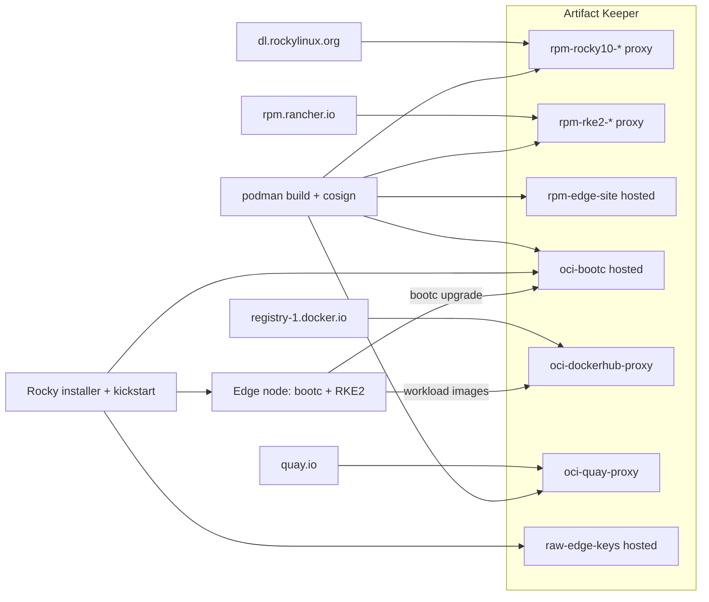

This post is about something less glamorous than most of what we write about: the hardware in a rack in a closet, the box somebody has to drive to when it misbehaves, and how to make every one of those boxes provably the same. If you know that person, share this with them.

## The problem: four sources of truth

The same application behaves differently on different machines, or fails on one and not the others, because each machine pulls its software from several places. After a few upgrades no two machines are identical, and in a fleet you have to be able to audit, that is the whole problem.

Image mode helps. With [bootc](https://bootc-dev.github.io/bootc/) (a tool that boots and updates a Linux system from a container image), the operating system is built once as an image and every machine boots the same one. Rocky Linux image mode is this idea on Rocky Linux. But the image is still assembled from parts fetched from several places: base RPMs from a public mirror, Kubernetes packages from a vendor repository, your own configuration from a tarball on someone's laptop, the finished image in yet another registry. Four sources of truth. When something goes wrong on node 37, nobody can say for sure where everything on it came from, or that any of it was approved.

This post shows how to keep every piece in one place, [Artifact Keeper](https://github.com/artifact-keeper/artifact-keeper), so every machine installs the same approved copy, rejects anything unapproved, and can be audited from the registry.

## One registry for everything a node boots from

This is the 30,000-foot view of a proof of concept. Artifact Keeper is an open-source universal artifact registry, and in this setup it holds every byte a node boots from:

- Rocky Linux 10 BaseOS, AppStream, extras and EPEL, as **RPM proxy repositories**
- RKE2 (Rancher's Kubernetes distribution) packages, as another **RPM proxy**
- our own `edge-site-config` package, in a **hosted RPM repository**
- the Rocky bootc base image we build ourselves, and the edge image built on top of it, in a **hosted OCI registry**
- the container images the cluster runs, through **OCI proxies** for Docker Hub and quay.io
- the public keys everything is verified against, in a **hosted generic repository**




A node boots the stock Rocky installer with a kickstart file (the answer file the Enterprise Linux installer reads so nobody has to type anything), pulls the edge image from Artifact Keeper, and comes up running RKE2. Upgrades are a `bootc upgrade` against the same registry. Every RPM and image is signed and checked on the way in.

If you want to build this yourself, the complete step-by-step with every command, Containerfile and screenshot is the [Rocky Linux image mode on bare metal walkthrough](https://artifact-keeper.github.io/walkthroughs/rocky-linux-image-mode-bare-metal/) on the Artifact Keeper walkthroughs site. The code lives in the same repository, [github.com/artifact-keeper/walkthroughs](https://github.com/artifact-keeper/walkthroughs/tree/main/rocky-linux-image-mode-bare-metal), and the walkthrough's reference pages have the [architecture](https://artifact-keeper.github.io/walkthroughs/rocky-linux-image-mode-bare-metal/architecture/), the [findings](https://artifact-keeper.github.io/walkthroughs/rocky-linux-image-mode-bare-metal/findings/) and the [troubleshooting](https://artifact-keeper.github.io/walkthroughs/rocky-linux-image-mode-bare-metal/troubleshooting/) notes. This post sticks to what we built, what it proved, and what surprised us.

## What we built, in six steps

**1. Stand up Artifact Keeper.** One compose file, about a minute to serving, and a bootstrap script that creates twelve repositories through the API and mints a scoped token so nothing routine uses the admin password. Edge nodes read anonymously, so every repository is public. The OCI registry is path-based (`host:30080/<repo-id>/<image>:<tag>`), which is what lets one registry hold separate image repositories with their own policies.

**2. Build the Rocky Linux image mode base.** We chose Rocky Linux because it is a community-run, open-source Enterprise Linux, which is what we want underneath hardware we will own for a decade. Rocky gives you the recipe for a bootc base rather than a finished image: the Rocky Enterprise Software Foundation's [`rocky-bootc`](https://git.resf.org/sig_containers/rocky-bootc) repository. We build it with one wrapper Containerfile that points the builder's dnf at the Artifact Keeper proxies, so all 242 RPMs in the base come through the registry. It built unmodified under rootless podman in under five minutes.

**3. Add Kubernetes and site configuration.** The edge image starts `FROM` our base in Artifact Keeper and installs RKE2 from Rancher's EL10 RPMs, proxied through the registry, plus our small `edge-site-config` RPM (RKE2 config, a MOTD that shows the release, a demo workload). A build gate fails the image if any dnf repository URL does not point at Artifact Keeper. Layer order is arranged so a site configuration change costs each node about 8 MB.

**4. Install on bare metal with a kickstart.** Network-boot the stock Rocky installer, hand it a kickstart with no `%packages` section, and let `ostreecontainer` pull the image from the registry. The only per-node inputs are a hostname and an SSH key. Power-on to a Ready Kubernetes node is about three minutes.

**5. Upgrade and roll back by moving a tag.** Promotion is a `skopeo copy` of a tag inside the registry. The node runs `bootc upgrade`, downloads 7.8 MB, reboots into the new image with the old one kept as rollback. `bootc rollback` puts everything back, workload manifests included.

**6. Sign everything, verify everywhere.** RPMs are signed with GPG, repodata is signed by Artifact Keeper, images are signed with cosign by digest, and the public keys live in a generic repository in the same registry. The build host, the installer and the node each carry a `policy.json` that refuses anything unsigned.

Here is what the installed node reports after its first boot:

```text
=== bootc status ===
spec:    image: 10.0.2.2:30080/oci-bootc/rocky-edge:10   transport: registry
booted:  version: 10.2-3   imageDigest: sha256:d4f3ec69bbd3...
=== getenforce ===
Enforcing
=== kubectl get nodes -o wide ===
NAME           STATUS   ROLES                VERSION          OS-IMAGE                        KERNEL-VERSION
edge-node-01   Ready    control-plane,etcd   v1.36.5+rke2r1   Rocky Linux 10.2 (Red Quartz)   6.12.0-211.61.1.el10_2.x86_64
=== Artifact Keeper: oci-dockerhub-proxy ===
98 cached objects; images: library/nginx, rancher/hardened-calico, rancher/hardened-coredns,
  rancher/hardened-etcd, rancher/hardened-kubernetes, rancher/klipper-helm, rancher/rke2-runtime, ...
OK: nginx-demo runs nginx:alpine @ sha256:df221db8..., and that manifest is cached in oci-dockerhub-proxy
```

Every image the cluster pulled, from `rancher/hardened-calico` to the demo's `nginx:alpine`, is cached in Artifact Keeper next to the RPMs and the operating system image that produced the node.

## What it proved

| What we measured | Result |
|---|---|
| Power-on to installer finished | 65 s |
| First boot to SSH | 25 s |
| SSH to Kubernetes node Ready | 61 s |
| Download for a site configuration change | 7.8 MB |
| `bootc upgrade` pull and stage | 6 s |
| Reboot to SSH after an upgrade | 20 s |
| Unsigned image at build, install, and upgrade | refused, all three |

The last row is the one we care about most. We built an unsigned image on purpose and pointed each consumer at it. The build host refused to use it as a base, the installer refused to deploy it, and a node running `bootc upgrade` refused to stage it, each with the same message:

```text
A signature was required, but no signature exists
```

After the refused upgrade, the node stayed on its signed deployment, nothing was staged, and RKE2 never noticed anything happened. Then the signed images went through the full install, upgrade and rollback again, with signatures checked at every hop.

## What surprised us

**Image mode fails differently than package mode.** We hit two real bugs, and neither showed up in `podman build`, `podman run`, or `bootc container lint`. The first install came up with every pod stuck in Pending because the network plugin could not write to `/opt`, which the base keeps on the read-only image; that only matters once the root filesystem is actually read-only. The first upgrade "succeeded" and then quietly booted the old image, because the base was missing the `bubblewrap` package that ostree needs to rebuild SELinux policy at shutdown; that only matters at the first upgrade. If you adopt image mode, your CI needs a stage that boots the image and upgrades it, not just builds it. The VM harness in the repo is that stage, and it is the part we would keep even if we changed everything else.

**The kickstart flag is not the switch.** Removing `--no-signature-verification` from the kickstart does nothing by itself. The installer's `policy.json` is what enforces signatures, for the installer and for `bootc upgrade` alike. Once we understood that, the same three files (policy, registries.d entry, public key) went into the build host, the kickstart and the image, and everything verified.

**cosign 3 and the containers tools disagree on format.** cosign's new default signature format is stored fine by Artifact Keeper and verifies with `cosign verify`, but podman, skopeo, bootc and the installer still read only the older `.sig` tag format. This was pretty confusing for a while. We sign in the older format for now, and the walkthrough has the exact flags.

## How Artifact Keeper makes this work

Its RPM proxies put the operating system and Kubernetes packages behind one address without mirroring anything by hand. Its hosted RPM repository generates and signs the metadata for our own package, and its proxies pass the vendors' signed metadata through untouched, so `repo_gpgcheck=1` works almost everywhere. Its OCI registry holds the base image, the edge image releases, and their cosign signatures side by side, and its Docker Hub and quay.io proxies catch every workload image the cluster pulls. Its generic repository serves the public keys. Promotion is a tag copy inside the registry, and `bootc upgrade`, dnf, podman and the installer all verify against it.

"What is running on node 37?" is now `bootc status` on the node and a digest lookup in one registry.

## How you can use it

The [walkthrough](https://artifact-keeper.github.io/walkthroughs/rocky-linux-image-mode-bare-metal/) takes you through all six steps with the commands and screenshots. The repo's `make all` generates keys, builds, signs and pushes everything, and `make vm-all` walks a virtual node through install, verification, a refused unsigned upgrade, a real upgrade, and rollback, so you can see the whole thing on a laptop before you touch hardware. From there, the hardening is deployment choices rather than new machinery: TLS at Artifact Keeper's front door, one DNS name for the registry, installing by digest, serving the installer media from the registry too, and blocking egress at the edge. The walkthrough's [next steps](https://artifact-keeper.github.io/walkthroughs/rocky-linux-image-mode-bare-metal/next-steps/) page covers each one.

## What's next for Artifact Keeper

Dogfooding Artifact Keeper this hard produced a handful of improvements, which is part of why we do these projects. The compose and documentation fixes are already in, so the quickstart you land on matches what this post describes. The [1.11.0 release](https://github.com/artifact-keeper/artifact-keeper/issues/4468) adds signature-aware views for OCI repositories, so cosign signatures show up on the image they belong to instead of as separate tags, corrects the storage accounting for shared layers, and adds server-side image signing, which turns the cosign step into a registry setting.

OpenTeams spends most of its days on AI and ML and the infrastructure that runs it, so this post was a detour into the closet. If that is your world, I hope it was useful.

Two invitations. If you run deployments that have grown complicated and you suspect a system like this could simplify them, I would like to hear about them, and we can work out where Artifact Keeper fits. And if you are a nerd like me who wants to try this in a home lab, I want to hear how that goes just as much.

A thank you to Edward Mora for putting Artifact Keeper to work at his company. This post is my open version of what I believe he built internally, and it would not exist without that example.

---

Questions, war stories, or home-lab results: bgeraci@openteams.com.
