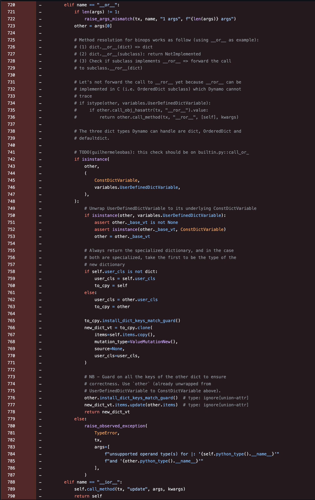

Recently Animesh Jain from Meta published a [blogpost](https://docs.pytorch.org/devlogs/dynamo/2026-05-13-agent-friendly-dynamo/) about the work we are doing in Dynamo. The gist of it is that we are refactoring Dynamo's object model to mirror CPython [PyTypeObject slots](https://docs.python.org/3/c-api/typeobj.html#tp-slots). Given that, I thought it would be interesting to write a follow-up post about one small corner of that work: the `tp_as_number` slot, and how binary operations are dispatched in CPython.

## Background

### `PyTypeObject` and tp slots

Every Python object has a type, and every type is represented internally by a `PyTypeObject`. For instance, the `int` and `str` types below are represented by `PyTypeObject` instances:

```python
type(42)    # <class 'int'>
type("hi")  # <class 'str'>
```

The `PyTypeObject` is a large struct that defines a type's behavior through slots. Each slot is a pointer to a function that implements a specific behavior of a type. For example, the `tp_as_number` slot is used for types that support numeric-style operations. The `tp_iter` and `tp_iternext` slots are used for types that support iteration. The `tp_call` slot is used for callable types, and so on.

### The `tp_as_number` slot

The `tp_as_number` slot is a pointer to a [`PyNumberMethods`](https://github.com/python/cpython/blob/13d8f452a11dc58690cb7aba0cad39bcca18f465/Include/cpython/object.h#L60-L105) struct, which contains function pointers for various numeric operations:

```c
typedef struct {
    binaryfunc nb_add;
    binaryfunc nb_subtract;
    binaryfunc nb_multiply;
    // ...
    binaryfunc nb_inplace_add;
    // ...
    unaryfunc nb_index;
    // ...
} PyNumberMethods;
```

One such example of a `binaryfunc` is the `nb_or` field, which is the function used to implement the `|` operator.

The name can be a bit misleading, because the `tp_as_number` slot is not just for numeric types (`int`, `float`, etc), but also for other types that support binary and unary operations. For example, set intersection `set1 & set2` is implemented by the [`nb_and`](https://github.com/python/cpython/blob/13d8f452a11dc58690cb7aba0cad39bcca18f465/Objects/setobject.c#L2437) slot. Dict merge `dict1 | dict2` is implemented by [`nb_or`](https://github.com/python/cpython/blob/13d8f452a11dc58690cb7aba0cad39bcca18f465/Objects/dictobject.c#L4776), among others.

### TorchDynamo

TorchDynamo (or simply Dynamo) is the JIT compiler that PyTorch uses to make PyTorch programs faster. Dynamo hooks into the eval frame API ([PEP 523](https://peps.python.org/pep-0523/)) to intercept the Python bytecode before it runs and symbolically trace it to an intermediate representation called *FX Graph*. It is worth mentioning that Dynamo is not a general-purpose Python implementation. It is designed to optimize a very specific class of programs and it works quite well for that purpose.

## Motivation

Dynamo was originally designed to cover a subset of Python programs that matter most for PyTorch. That design worked well enough to support many important workloads, but it became more difficult to extend to support more Python features. One such example is the `dict.__or__` implementation [added in 2025](https://github.com/pytorch/pytorch/pull/155072/changes#diff-431bf581d909ccf8d17a8da7382ca72e6a8a81eeb0328cc387464e9a455065dc) which was recently replaced by the `nb_or` slot:



*Dynamo's ad-hoc impl. of `dict.__or__` before the slot-based rewrite*

This snippet of code almost certainly misses some corner cases that are not caught by the test suite. It also shows we are trying to mimic parts of the dispatch logic that CPython gets for free but in a completely ad-hoc way.

Over time, some of the core logic became less about well-defined rules and more about accumulating special cases. When Dynamo discovered a new gap with CPython, we would often patch that gap directly. This was pragmatic, and I have written my fair share of this kind of code, but it made the codebase much harder to reason about.

The `tp_*` slot work is an attempt to replace some of the ad-hoc logic with a model based on the same rules CPython uses, improving both behavior coverage and code clarity.

## The dispatch algorithm

For a single binary operation `left | right`, it is natural to think CPython simply calls `left.__or__(right)`. This is almost right, but there is a catch: in some cases, the right-hand side gets the first chance to handle the operation. CPython's dispatch algorithm is roughly:

1. Look up the slot for `left`.
2. Look up the slot for `right`.
3. If `right` is a subclass of `left`, and it provides a different implementation, try `right` first.
4. Otherwise, try `left` first.
5. If the first attempt returns `NotImplemented`, try the other side.
6. If every implementation returns `NotImplemented`, raise a `TypeError`.

This is essentially the algorithm implemented by [`binary_op1`](https://github.com/python/cpython/blob/13d8f452a11dc58690cb7aba0cad39bcca18f465/Objects/abstract.c#L926-L977) in CPython. This function works on slots like `nb_or`, `nb_add`, etc.

### The `SLOT1BIN` macro

`SLOT1BIN` is the glue that allows dunder methods to participate in the binary protocol. The `binary_op1` function operates on C slots, but Python defined classes have dunder methods instead. The `SLOT1BIN` / `SLOT1BINFULL` macros are responsible for generating wrapper functions to bridge the gap between the slots and the dunder methods.

```python
class A:
    def __or__(self, other):
        return "A.__or__"

    def __ror__(self, other):
        return "A.__ror__"
```

For the class `A`, once `binary_op1` dispatches the call to `A.tp_as_number.nb_or`, it will go through the generated wrapper which maps that slot invocation back to `A.__or__`.

The last detail from the `SLOT1BIN` macro is how it handles the reflected method (`__ror__` in this case). The wrapper calls the reflected method in two cases.

**Case 1:** `Right` is a subclass of `Left` and `Right.__ror__` is overridden.

```python
class Left:
    def __or__(self, other):
        return "handled by Left"

class Right(Left):
    def __ror__(self, other):
        return "handled by Right"

print(Left() | Right())  # "handled by Right"
```

**Case 2:** `Left.__or__` returns `NotImplemented` and `Left` and `Right` are different types.

```python
class Left:
    def __or__(self, other):
        return NotImplemented

class Right:
    def __ror__(self, other):
        return "handled by Right"

print(Left() | Right())  # "handled by Right"
```

I suggest reading the [implementation](https://github.com/python/cpython/blob/13d8f452a11dc58690cb7aba0cad39bcca18f465/Objects/typeobject.c#L9211-L9252) of `SLOT1BINFULL` to understand how CPython implements this logic.

## The new `dict.__or__` implementation

Recall that `tp_as_number` points to a `PyNumberMethods` struct, and `nb_or` is the entry in that struct used by the `|` operator. With the new slot-based implementation, the `dict.nb_or` slot becomes a straight translation of the CPython implementation to Python:

```c
static PyObject *
dict_or(PyObject *self, PyObject *other)
{
    if (!PyDict_Check(self) || !PyDict_Check(other)) {
        Py_RETURN_NOTIMPLEMENTED;
    }
    PyObject *new = PyDict_Copy(self);
    if (new == NULL) {
        return NULL;
    }
    if (dict_update_arg(new, other)) {
        Py_DECREF(new);
        return NULL;
    }
    return new;
}
```

*CPython impl. for dict `tp_as_number.nb_or` ([source](https://github.com/python/cpython/blob/13d8f452a11dc58690cb7aba0cad39bcca18f465/Objects/dictobject.c#L4643-L4658))*

And here is the equivalent Dynamo implementation:

```python
def nb_or_impl(
    self,
    tx: Any,
    other: VariableTracker,
    reverse: bool = False,
) -> VariableTracker:
    if pydict_check(self_) and pydict_check(other_):
        new = self_.call_method(tx, "copy", [], {})
        new.call_method(tx, "update", [other_], {})
        return new
    return ConstantVariable.create(NotImplemented)
```

*Dynamo impl. of dict `nb_or` ([source](https://github.com/pytorch/pytorch/blob/862cb8fb254273306ab4fe1e465d5b06d04a48c1/torch/_dynamo/variables/dicts.py#L729-L741))*

Both the `binary_op1`, `SLOT1BIN` and `nb_or` were added to PyTorch in the pull request [#181326](https://github.com/pytorch/pytorch/pull/181326) as part of the effort to support not just `nb_or` but the `tp_as_number` slot in general.

The slot-based implementation is useful for a few things:

* The new behavior is consolidated in a shared dispatch mechanism instead of being scattered in many ad-hoc ones across the codebase
* The translation from C to Python can be partially done by an LLM
* One could validate the implementation using the CPython tests

We can leverage the recent developments in LLMs to help with the transition. The generated code still needs to be reviewed and tested, but it can significantly reduce the cost of implementing some of this work.

## Leveraging the CPython test suite

CPython has a test suite containing more than 750 test files that span from I/O to the standard library, representing more than 30 years of development effort in implementing the Python interpreter.

Last year I started an effort to port a subset of those tests to Dynamo. PyTorch currently runs 4,729 tests which are spread across 45 test files. It is a small subset, but it covers many of the core behaviors that Dynamo needs to model: builtin types, data structures, exceptions, and math operations.

For more information, check out the dashboard I maintain on [Streamlit](https://dynamo-skips-stokfmqs6saxc7ys4tqojw.streamlit.app/), which tracks the progress of running the CPython tests on PyTorch main branch. When this effort started, only 37% of those tests were passing. At the time of writing this post, this number is close to 50%.

## Conclusion and next steps

The port of `binary_op1` / `SLOT1BIN` to Dynamo was implemented in the pull request [\#181326](https://github.com/pytorch/pytorch/pull/181326). This work was part of the effort to add `nb_or` as the first `tp_as_number` slot supported by Dynamo.

This work aligns with the vision described in Animesh's blogpost: to move from an implementation that works by accident to a model that we can reason about and validate against CPython source code and tests.

## References

* [agent friendly dynamo - PyTorch DevLog](https://docs.pytorch.org/devlogs/dynamo/2026-05-13-agent-friendly-dynamo/)
* [PyTorch \#181326](https://github.com/pytorch/pytorch/pull/181326)
* [CPython binary\_op1](https://github.com/python/cpython/blob/13d8f452a11dc58690cb7aba0cad39bcca18f465/Objects/abstract.c#L926-L977)
* [CPython SLOT1BINFULL](https://github.com/python/cpython/blob/13d8f452a11dc58690cb7aba0cad39bcca18f465/Objects/typeobject.c#L9211-L9252)
