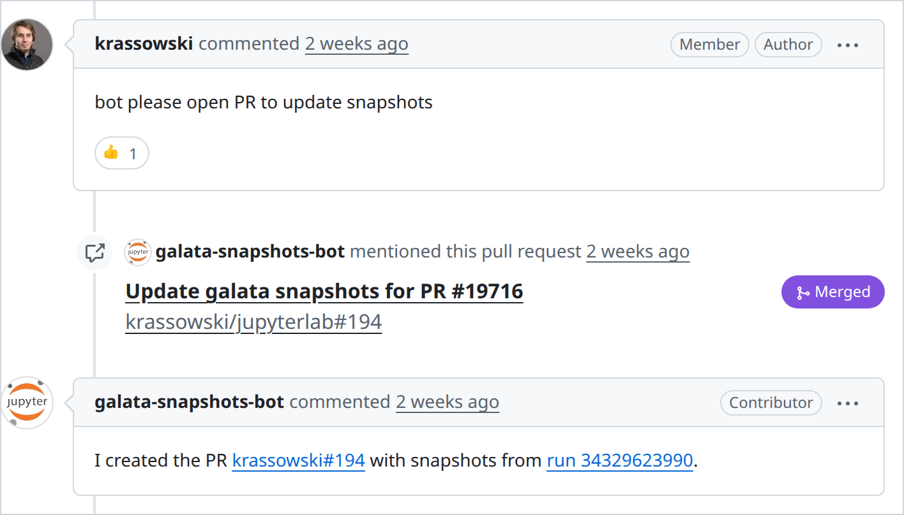
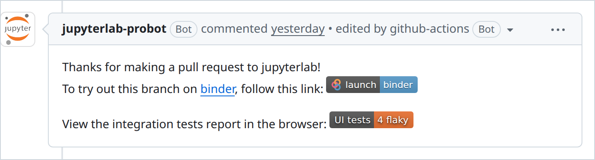

JupyterLab uses visual regression testing to catch unintended changes to the interface before a release: it compares about 350 reference screenshots (snapshots, in Playwright's terms) on every pull request. The tests use [Galata](https://github.com/jupyterlab/jupyterlab/tree/main/galata), JupyterLab's test framework built on Playwright. Until February 2026 the suite took 55 minutes, and now it takes 14 to 16. Flaky tests, which fail once and pass on retry, went from 17 per run in January to 2.4 in August. Any contributor can now request new reference images with a comment. A local run on Linux with the CI fonts produces the same pixels as CI, and on Fedora 44 with its default fonts, 85% of the screenshots match.

In the three months to 25 September 2026, 28 of the 30 merged pull requests that added or changed a UI test in JupyterLab were AI-assisted.[^ai] A developer who works with an agent on interface code needs a test that runs on their machine, a result they can trust, and an answer in minutes.

This post describes what we changed and which parts you can reuse for Playwright tests on GitHub Actions.

## Before and after

| | Before | Now |
| --- | --- | --- |
| Suite run time | 42 min to 1 h 25 min, 55 min on average | 14 to 16 min |
| Regenerating screenshots | about 45 min, started by a maintainer | about 1 min, requested by any contributor |
| Local run matches CI | no | yes, with the CI fonts |
| Looking at a failure | download and unzip the report, start a web server | click a badge in the pull request |
| Flaky tests per run | 17 (January 2026) | 2.4 (August 2026) |
| Runs with a hard failure | 54% (January 2026) | 14% (August 2026) |

[Fixing the flaky tests](https://github.com/jupyterlab/jupyterlab/pull/18453) uncovered real bugs. Many tests were flaky because of a bug in JupyterLab that appeared only under CI timing. Examples are [a notebook that took focus while it initialized](https://github.com/jupyterlab/jupyterlab/issues/18457), [a race when several settings change quickly](https://github.com/jupyterlab/jupyterlab/issues/18458) and [a debugger that did not show its variables after F9](https://github.com/jupyterlab/jupyterlab/issues/18461). While pinning the fonts for the tests, we found three parts of the interface that ignored the configured font. All 19 bugs found this way are fixed.[^bugs]

We also ran the Chromium tests on two setups other than the CI runner: Fedora 44 with its default fonts, and the Ubuntu 26.04 runner that CI will have to move to.[^setups]

| | Before | Now |
| --- | ---: | ---: |
| Fedora 44: screenshots that match CI | 1% | 85% |
| Fedora 44: tests that pass | 56% | 93% |
| Ubuntu 26.04 runner: screenshots that match CI | 35% | 100% |
| Ubuntu 26.04 runner: tests that pass | 71% | 99.8% |

## If you work with a coding agent

If you would like to submit a PR to JupyterLab with a coding agent's assistance:

- Your agent can now check its work and generate reference images on your Linux machine.
- A failure usually means a real problem. This is important because, given a false failure, an agent may attempt to edit working code, often making unnecessary edits or masking underlying issues (since debugging the unrelated test is not its prime objective).
- After opening a PR you get an answer in 15 minutes not 55 minutes. This translates to 30 iteration rounds per working day, rather than 8 as previously.
- The rules are in files the agent reads. JupyterLab's [AGENTS.md](https://github.com/jupyterlab/jupyterlab/blob/main/AGENTS.md) points to the contributing guide, and the guide lists the testing practices described below. Lint rules report fixed waits and hand-written selectors before a reviewer reads the test. Darshan Paudyal explains [why an agent follows a lint rule more reliably than an instruction in AGENTS.md](https://openteams.com/lint-rules-for-ai-agents/).
- You and a reviewer can watch what the agent's test does. The report has a video of every new or changed test.

## Same pixels locally and on CI

A screenshot of the interface is mostly text, and text rendering depends on the machine. We found these causes:

- Fonts come from the operating system, so they differ between a laptop and the CI runner, and between two point releases of one Linux distribution.
- Playwright's `install-deps` installed about 80 system packages on CI, among them fonts that developer machines do not have (e.g. `xfonts-cyrillic`). The theme asked for `system-ui` first, so the font used depended on the installed packages.
- The browser defaults for subpixel antialiasing, font smoothing, optical sizing and kerning differ between platforms.
- The terminal uses a WebGL renderer when WebGL is available and a DOM renderer when it is not, and the two draw text differently.
- Text drawn on a canvas, as in the terminal and the data grid, does not use CSS.
- The IPython console banner shows the IPython version, so console screenshots changed with every IPython upgrade.

JupyterLab 4.6 fixes all of them. The Galata helper extension ships its own fonts as npm dependencies, so the lockfile pins their versions:

```json
"@fontsource/dejavu-sans": "^5.2.5",
"@fontsource/dejavu-mono": "^5.2.5",
"@fontsource-variable/noto-sans-sc": "^5.2.10"
```

It applies them over the system fonts, and sets the properties that the browser would otherwise choose:

```css
:root {
  --jp-code-font-family-default: 'DejaVu Mono' !important;
  font-kerning: normal;
  -webkit-font-smoothing: none;
  -moz-osx-font-smoothing: none;
  font-optical-sizing: none;
}
```

The tests [start Chromium](https://github.com/jupyterlab/jupyterlab/blob/main/galata/playwright.config.js) with `--disable-lcd-text`, which turns off subpixel antialiasing, and `--disable-webgl`, which makes the terminal use its DOM renderer.

We [stopped running `install-deps`](https://github.com/jupyterlab/jupyterlab/pull/18568). The only font it installed that the tests needed was one for Chinese characters, and Noto Sans SC in the list above took its place.

The terminal emulator, xterm.js, has no API for kerning or text rendering, so the tests set them on the canvas context:

```ts
ctx.fontKerning = 'normal';
ctx.textRendering = 'geometricPrecision';
```

The data grid did not apply the configured `font-family` to its canvases. Users saw this too, so we [fixed it in JupyterLab](https://github.com/jupyterlab/jupyterlab/pull/18542).

The console banner is off in the default Galata settings. IPython now [prints a static banner when `SOURCE_DATE_EPOCH` is set](https://github.com/ipython/ipython/pull/15144).

The new fonts changed every existing screenshot, and [one pull request](https://github.com/jupyterlab/jupyterlab/pull/18535) updated 310 reference images. No version of the fonts reproduced the old images, and neither did fonts copied from the CI runner. The update was due anyway: moving CI from Ubuntu 22.04 to 24.04 broke about 150 tests through font versions alone. With the fonts pinned, a runner upgrade no longer changes the fonts in the screenshots.

### Fedora and openSUSE

We ran the Chromium tests in [Fedora 44 and openSUSE Tumbleweed containers](https://github.com/krassowski/jupyterlab/actions/runs/36240377663) on GitHub Actions, against the reference images from the Ubuntu runner. With the runner's font packages installed (DejaVu, Liberation, Lato and Noto Color Emoji), both matched all 255 screenshot comparisons. openSUSE also needed the three fontconfig rules that turn off hinting for small DejaVu text, which Ubuntu and Fedora ship with the font.

With the fonts that Fedora 44 installs by default, 39 screenshots still differ, all of Mermaid diagrams. JupyterLab shows a Mermaid diagram as an SVG image, and an image cannot use the fonts of the page, so its text uses a system font. Two Vega charts had the same problem because they asked for `sans-serif`, and the test chart now [sets DejaVu Sans in its Vega config](https://github.com/jupyterlab/jupyterlab/pull/19941).

### macOS and Windows

We tried reusing the Linux reference images on the macOS and Windows runners of GitHub Actions, with a sample of 20% of the screenshots, and at first 4% matched. We overrode `navigator.platform`, because macOS menus showed shortcuts as symbols and were up to 63 pixels narrower. We also turned off glyph hinting and subpixel positioning on Linux with `--font-render-hinting=none` and `--disable-font-subpixel-positioning`. After that no element differed in size, but only 14% of the screenshots matched on macOS and 4% on Windows. FreeType, CoreText and DirectWrite draw the same glyphs differently, and neither the operating systems' font smoothing settings nor Chromium's `--text-contrast` and `--text-gamma` switches changed that. The option left is a tolerance per platform: with `maxDiffPixelRatio: 0.01`, 59% of the failing screenshots would pass on macOS and 53% on Windows.

## Snapshot updates from the failed run

The old workflow for new reference images rebuilt JupyterLab, ran the whole suite with `--update-snapshots` and pushed the result. A maintainer had to start it, and it took about 45 minutes to produce a few images.

The failed run already has those images. Playwright writes the actual screenshot next to the expected one for every failed comparison, and its JSON reporter records which reference file each one belongs to. We enabled the JSON reporter on CI:

```js
reporter: process.env.CI
  ? [['blob'], ['json', { outputFile: 'test-results/report.json' }]]
  : [['list'], ['html', { open: 'on-failure' }]],
```

A script, [unpack_snapshots.py](https://github.com/jupyterlab/jupyterlab/blob/main/scripts/unpack_snapshots.py), copies each image to the path of its reference.

Now a contributor writes this comment on their pull request:

```text
please open PR to update snapshots
```

After a maintainer approves the run, a bot waits for the test run of the head commit to finish, takes the screenshots from its artifacts, and opens a pull request against the contributor's branch. A new request on the same pull request replaces the one in progress. The contributor accepts the new images by merging it. After the test run, the bot takes about a minute. The time grows with the number of changed screenshots and does not depend on the number of tests.



The bot covers Galata screenshots, JSON snapshots, documentation screenshots and example snapshots.

### Why the bot opens a pull request

Pushing to the contributor's branch needs a token with write access, in a job that anyone can start with a comment. For that reason the old workflow was limited to maintainers. Our bot commits to its own fork and opens a pull request against the contributor's branch, so it has no write access to the repository. The write happens when the contributor merges.

A GitHub App cannot do this. An App can open pull requests inside its organisation, but not against a fork owned by someone else, so we use a plain bot account with a personal access token.

The workflow also [limits what it does](https://github.com/jupyterlab/jupyterlab/pull/19946) with files from the pull request:

- The unpacking script comes from the default branch, so a pull request cannot change it.
- A job without the bot token downloads the test artifact, unpacks it and compresses the images. It passes on only the snapshot files.
- Only files in snapshot directories (`galata/**/*-snapshots/` and `examples/**/*-snapshots/`) are accepted. The job that holds the token checks each path again, and refuses a path that a symbolic link redirects.
- Git hooks are off in both jobs. The commit flag `--no-verify` alone skips the pre-commit hook, but not `post-checkout` or `post-commit`.
- The token is in a GitHub Actions environment. Its protection rules require the approval of a maintainer for each run.

## Looking at a failure without a download

A Playwright HTML report is a directory of HTML, scripts, screenshots and videos. As a GitHub Actions artifact it is a zip, so to look at a failure you downloaded it, unzipped it, started `python -m http.server` and opened localhost. Most reviewers did not.

In February 2026, GitHub Actions added artifact uploads without a zip (`archive: false`), and it serves a single uploaded HTML file directly. We asked Playwright to [make its report self-contained](https://github.com/microsoft/playwright/issues/39630), and the maintainers declined because the need is niche. Our action, [inline-playwright-report](https://github.com/jupyterlab/maintainer-tools/tree/main/.github/actions/inline-playwright-report), does it instead. The report keeps its assets in a base64 zip inside `index.html`, so the action rewrites the `src` attributes inside that zip.

The bot comment on every JupyterLab pull request now has [a badge](https://github.com/jupyterlab/jupyterlab/pull/18798): green when all tests pass, orange with the number of flaky tests, red with the number of failures. The link opens the report filtered to the flaky or failed tests.



When a pull request adds or changes a test, the workflow [runs that test again with video recording](https://github.com/jupyterlab/jupyterlab/pull/18865), and the video goes into the same report.

## Posting results from a fork's pull request

A `pull_request` workflow from a fork cannot write comments. The usual solution is a second workflow, triggered by `workflow_run`, that has write permissions and reads an artifact from the first one. Code from the fork produced that artifact, so its content is untrusted. The comment built from it appears under a trusted bot account.

The comment takes two values from the artifact: the link to the report, and the failing and flaky counts. Without checks, a fork could make the trusted bot post a phishing link, or end the markdown link early and add its own text to the comment. [The action](https://github.com/jupyterlab/maintainer-tools/tree/main/.github/actions/ui-test-report-comment) makes these checks:

- It parses the URL with `new URL()` instead of inserting the string. This removes newlines and encodes angle brackets, so the value cannot escape the markdown link.
- It requires the URL to point at an artifact of the run being reported. A URL anywhere in your own repository is not safe enough, because GitHub serves the commits of a fork under the base repository: `https://github.com/you/yourrepo/blob/<sha>/evil.html` can be attacker content.
- It compares the head commit of the run with the head commit of the pull request in the artifact. This check also skips runs from an older push.
- It edits only comments written by a bot. A "Quote reply" of the badge by a person starts with the same text.
- It accepts the failing and flaky counts only as non-negative integers, and shows `Unknown` otherwise.
- It puts the URL in angle brackets in the markdown link, because a closing parenthesis in the URL ends the link early.

We also run [zizmor](https://github.com/zizmorcore/zizmor) on the workflow files, in CI and as a pre-commit hook. It correctly flags the `workflow_run` trigger, so that line has an inline exemption that explains the reason.

## Measuring flakiness

Flakiness measured on pull requests includes the effects of each change. Since December 2025, JupyterLab [runs the suite every six hours on `main`](https://github.com/jupyterlab/jupyterlab/pull/18248). The inputs are the same every time, so any difference between runs is flakiness.


Every Monday, [a script](https://github.com/jupyterlab/jupyterlab/pull/19130) reads the last 28 scheduled runs and posts a table to [a public issue](https://github.com/jupyterlab/jupyterlab/issues/19153). The table lists which tests failed, which passed only on retry, how often, and in which browser. It shows when the count starts to rise again.

To check a fix, you can [start the workflow by hand](https://github.com/jupyterlab/jupyterlab/pull/18800) with a test name pattern for Playwright's `--grep` and a repeat count of up to 50.

### Practices and lint rules

Most flaky tests, outdated screenshots and quirks of the snapshot updating workflows had one of a few causes, and [the contributing guide](https://github.com/jupyterlab/jupyterlab/blob/main/docs/source/developer/contributing.md) now lists best practices for writing UI tests:

- Compare only one screenshot per test, unless you use `expect.soft`. Otherwise the first failure hides the others, and the update takes several CI rounds.
- Capture the smallest region that shows the change.
- Do not use `waitForTimeout()`.
- Compute crop dimensions instead of hard-coding them.
- Open notebooks without a kernel when the test does not run code.

Lint rules enforce some of these:

- [eslint-plugin-playwright](https://github.com/playwright-community/eslint-plugin-playwright), with five rules set to error: `no-wait-for-timeout`, `no-element-handle`, `no-networkidle`, `prefer-to-have-count` and `prefer-web-first-assertions`.
- [@jupyter/eslint-plugin](https://github.com/jupyterlab/eslint-plugin), with rules that report hand-written selectors where a Galata helper exists, and require soft assertions before screenshot comparisons.
- `no-restricted-syntax` rules against `screenshot({ path })`, because the result should go through `toMatchSnapshot()`, and against `test.describe.configure({ mode: 'serial' })`, because serial tests cannot be split across shards.
- A stylelint rule that [requires CSS variables](https://github.com/jupyterlab/jupyterlab/pull/18614) for some properties, so a hard-coded font cannot return.

The Playwright rules [highlighted 118 violations](https://github.com/jupyterlab/jupyterlab/pull/19106) in 36 files. We enabled it gradually, suppressing the existing violations with inline `eslint-disable` comments and slowly working through the old ones in follow-up PRs.

## Sharding

With [six shards per browser](https://github.com/jupyterlab/jupyterlab/pull/18427), the suite takes 15 minutes instead of 55.[^runtime] Set `fullyParallel: true`, or Playwright cannot balance the shards.


The setup step runs once per shard, so each extra minute there costs six minutes of runner time. We replaced two lines:

```diff
- playwright install-deps
- playwright install chromium
+ playwright install chromium --only-shell
```

`install-deps` installs about 80 apt packages that headless tests do not use, and the apt step failed often enough to cancel jobs. If you test with Firefox or WebKit, remove `install-deps` but do not add `--only-shell`: it applies to Chromium only.

We also removed Python test dependencies that the browser tests did not use, and a second frontend build. The browser cache key pointed at a missing file, so the cache was not refreshed when Playwright was updated. We fixed the key.

When one shard fails, you can re-run only that shard. A re-run produces blobs for its own shard only, so the merge job [starts from the merged blobs of the previous attempt](https://github.com/jupyterlab/jupyterlab/pull/18801).

## Reusable parts

Two composite actions in [jupyterlab/maintainer-tools](https://github.com/jupyterlab/maintainer-tools) (BSD-3-Clause) work in any repository:

- [inline-playwright-report](https://github.com/jupyterlab/maintainer-tools/tree/main/.github/actions/inline-playwright-report) turns a Playwright report into one HTML file that GitHub serves directly.
- [ui-test-report-comment](https://github.com/jupyterlab/maintainer-tools/tree/main/.github/actions/ui-test-report-comment) posts and updates the badge, with the checks above.

These parts need a few changes before you can reuse them:

- [unpack_snapshots.py](https://github.com/jupyterlab/jupyterlab/blob/main/scripts/unpack_snapshots.py): replace `galata`, the test directory name in its paths, with your own.
- [galata-update-v2.yml](https://github.com/jupyterlab/jupyterlab/blob/main/.github/workflows/galata-update-v2.yml): change the trigger phrases, the names of the test workflow and its artifact, and the list of paths the bot may commit.
- [fonts.ts](https://github.com/jupyterlab/jupyterlab/blob/main/galata/extension/src/fonts.ts) is a JupyterLab plugin. In another application, load the same `@fontsource` packages and CSS from an entry point that only the tests use.
- [playwright.config.js](https://github.com/jupyterlab/jupyterlab/blob/main/galata/playwright.config.js): copy the two Chromium flags into your configuration.

## Open work

- A few tests per run are still flaky (2.4 on average in August), and [the weekly report](https://github.com/jupyterlab/jupyterlab/issues/19153) lists them.
- 36 `waitForTimeout` calls remain behind `eslint-disable` comments.
- Mermaid diagrams still use system fonts, so their screenshots match only on a machine with the runner's fonts.

## Credits

This work was a collaboration with Quansight PBC. At OpenTeams, [@krassowski](https://github.com/krassowski) led the work, and [@MUFFANUJ](https://github.com/MUFFANUJ) and [@Darshan808](https://github.com/Darshan808) worked on the flaky test fixes, the CI tooling and the lint rules.

The Jupyter Foundation [funded this work](https://github.com/jupyter-governance/funding-proposals/issues/7). [@jtpio](https://github.com/jtpio) opened [the 2023 issue](https://github.com/jupyterlab/jupyterlab/issues/14947) that described the problem, [@bollwyvl](https://github.com/bollwyvl) [asked for a readable CI report](https://github.com/jupyterlab/jupyterlab/issues/17831), and [@jasongrout](https://github.com/jasongrout) [set up the scheduled runs](https://github.com/jupyterlab/jupyterlab/pull/18248) that give the flakiness numbers in this post.

Thank you to the reviewers: [@jtpio](https://github.com/jtpio), [@jasongrout](https://github.com/jasongrout), [@brichet](https://github.com/brichet), [@Yann-P](https://github.com/Yann-P), [@HaudinFlorence](https://github.com/HaudinFlorence) and [@mfisher87](https://github.com/mfisher87).

[^ai]: Counted from the AI usage section of the JupyterLab [pull request template](https://github.com/jupyterlab/jupyterlab/blob/main/.github/pull_request_template.md). The section asks whether AI generated some or all of the content. The count covers pull requests merged into `main` from 25 June to 25 September 2026 that changed a test file in `galata/test`. It leaves out backports and pull requests from bots. The other two pull requests did not answer.

[^bugs]: Found through flaky tests:

    - [A notebook took focus while it initialized](https://github.com/jupyterlab/jupyterlab/issues/18457)
    - [Settings changed in quick succession overwrote each other](https://github.com/jupyterlab/jupyterlab/issues/18458)
    - [A toolbar item added by an extension was sometimes placed wrongly in the popup toolbar](https://github.com/jupyterlab/jupyterlab/issues/18459)
    - [The prompt in the notebook tools blinked when switching cells](https://github.com/jupyterlab/jupyterlab/issues/18460)
    - [The active cell field in the notebook tools leaked memory](https://github.com/jupyterlab/jupyterlab/pull/19168)
    - [The debugger did not always show its variables after F9](https://github.com/jupyterlab/jupyterlab/issues/18461)
    - [The search-in-selection filter did not always switch from cells to lines](https://github.com/jupyterlab/jupyterlab/issues/18462)
    - [A cell did not always scroll into view with windowing off](https://github.com/jupyterlab/jupyterlab/issues/18468)
    - [With line wrapping on, a notebook could scroll back and forth in an endless loop](https://github.com/jupyterlab/jupyterlab/issues/18470)
    - [The debugger icon flickered while the kernel started](https://github.com/jupyterlab/jupyterlab/issues/18514)
    - [The output limit grew when a cell requested input](https://github.com/jupyterlab/jupyterlab/issues/18508)
    - [A notebook opened with no kernel could connect to a kernel already running for the same file](https://github.com/jupyterlab/jupyterlab/issues/18257)
    - [Scrolling to a heading from the table of contents could fail](https://github.com/jupyterlab/jupyterlab/pull/18961)
    - [A workspace did not always open on the first double click](https://github.com/jupyterlab/jupyterlab/pull/18961)
    - [Clearing an output could scroll the notebook back up](https://github.com/jupyterlab/jupyterlab/pull/19151)
    - [Inline completion sent too many history requests to the kernel](https://github.com/jupyterlab/jupyterlab/pull/19716)

    Found while pinning the fonts:

    - [The data grid ignored the configured font](https://github.com/jupyterlab/jupyterlab/issues/18539)
    - [Buttons, inputs and drop-down lists ignored the configured font](https://github.com/jupyterlab/jupyterlab/issues/18537)
    - [The path above the file browser ignored the theme font](https://github.com/jupyterlab/jupyterlab/issues/18926)

[^setups]: Measured on GitHub Actions on 26 September 2026 with the Chromium tests of the `jupyterlab` project, in a Fedora 44 container and on the Ubuntu 26.04 runner. "Before" is JupyterLab's main branch on 4 February 2026, before the first change of this work, with its own lockfile and Playwright version, and Python packages as of that date. A test or screenshot that passes on the retry counts as passing, as on CI.

    - The Fedora 44 run had 41 failing tests: 39 Mermaid diagrams and 2 Vega charts, each failing on its screenshot only. The Vega charts got a pinned font after the run, so "Now" counts them as matching: 216 of 255 screenshots and 539 of 578 tests.
    - Screenshots: 235 comparisons before and 255 now. A test stops at its first failing screenshot, so fewer comparisons are reached when many fail.
    - Tests: 518 before and 578 now, without the tests that the CI runner skips too. On the CI runner itself, 517 and 518 of 518 tests passed in two runs before, and 578 of 578 now.
    - The Playwright version of February refuses to install Chromium on Ubuntu 26.04, so that run used the Chromium build for Ubuntu 24.04. Most of its screenshot mismatches are coloured fringes around text: the 26.04 image turns on subpixel rendering, and the Chromium flag that turns it off came with this work.

[^runtime]: The median of the 51 runs on `main` from [the update to Playwright 1.58](https://github.com/jupyterlab/jupyterlab/pull/18391) on 26 January 2026 to the change to six shards on 4 February. After the update, the median Firefox job took 50 minutes instead of 42. The median Chromium job took 43 minutes instead of 42. From October 2025 to the update, the median run took 43 minutes. The Firefox shards are still about 20% slower than the Chromium shards, so we compare with the runs that used the same Playwright version.
